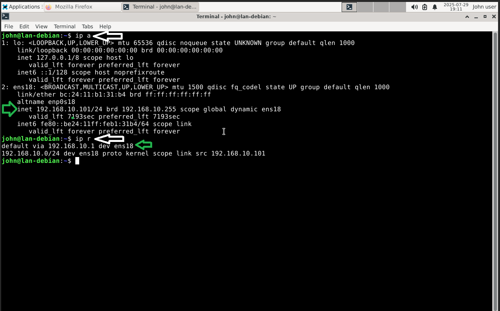
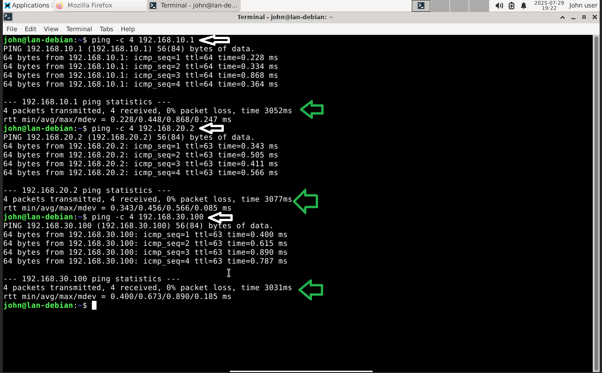
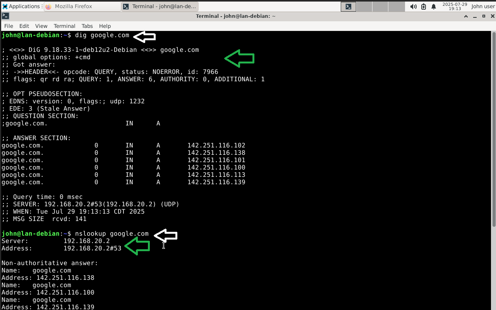

# 🧑‍💻 Debian Admin Workstation (VLAN 10)

## 🔧 Network Configuration

- **VLAN**: 10  
- **Interface**: `ens18`  
- **IP Address**: 192.168.10.101 (via DHCP or static)  
- **Gateway**: 192.168.10.1  
- **DNS**: 192.168.20.2 (Pi-hole)

---

## 🔍 Network Verification Commands

| Test                        | Command                                  | Expected Output                         |
|-----------------------------|-------------------------------------------|-----------------------------------------|
| Show IP address             | `ip a`                                    | IP: `192.168.10.101`                    |
| Show default route          | `ip r`                                    | Default via `192.168.10.1`              |
| Ping Gateway                | `ping -c 4 192.168.10.1`                  | Successful replies                      |
| Ping DNS Server             | `ping -c 4 192.168.20.2`                  | Successful replies                      |
| Ping Kali                   | `ping -c 4 192.168.30.100`                | Successful replies                      |
| DNS Resolution              | `dig google.com` or `nslookup google.com` | Correct name resolution                 |

---

## 📸 Screenshot Checklist

- `ip a` and `ip r` output

- `ping` to gateway, DNS, and Kali

  
- `dig` or `nslookup` results  

