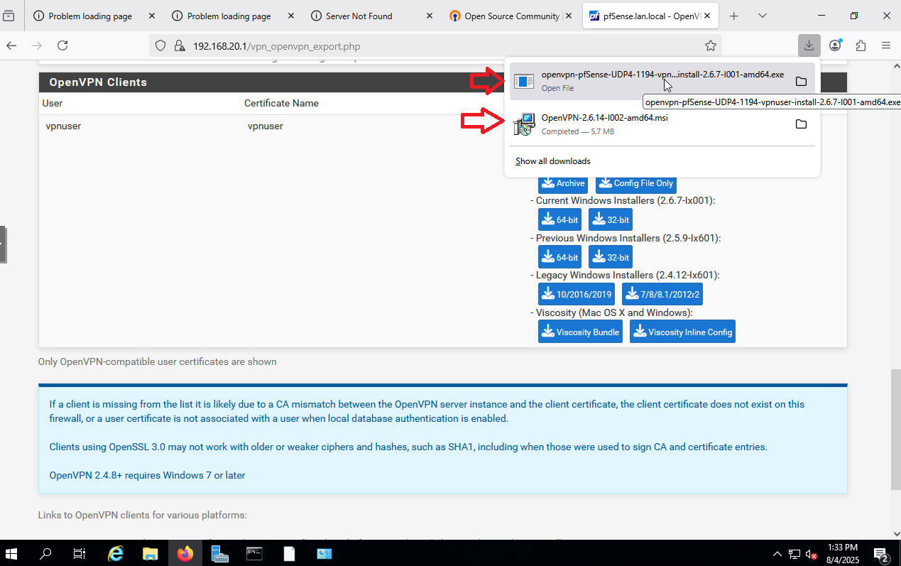
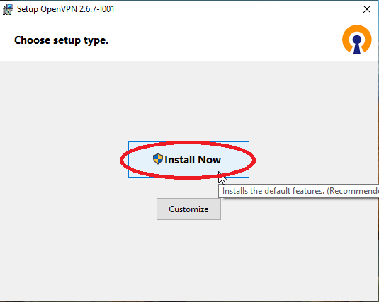
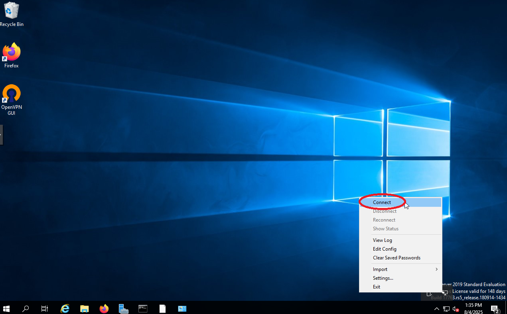
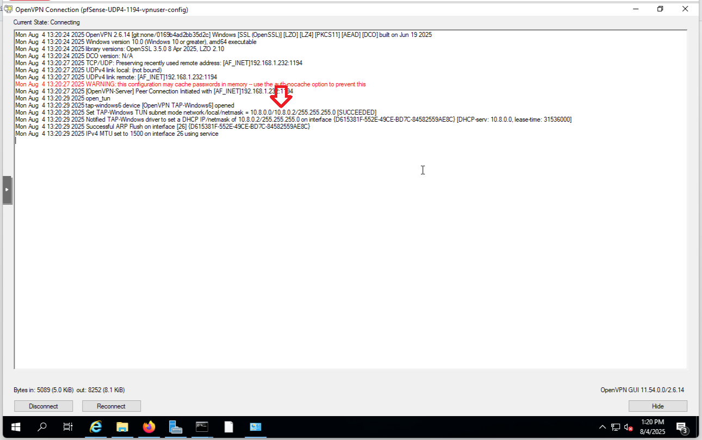

# 🛡️ OpenVPN Setup on pfSense — Step-by-Step Guide

This guide walks through setting up an OpenVPN server on **pfSense** and connecting a Windows client. Each section is meant to be documented with screenshots alongside the steps.

## Table of Contents

1. 🏛️ [Create a Certificate Authority (CA)](#-1-create-a-certificate-authority-ca)  
2. 🏷️ [Create the Server Certificate](#-2-create-the-server-certificate)  
3. 👤 [Create a User Certificate](#-3-create-a-user-certificate)  
4. 🧙 [Run the OpenVPN Wizard](#-4-run-the-openvpn-wizard)  
5. 💾 [Export the OpenVPN Client Configuration](#-5-export-the-openvpn-client-configuration)  
6. 🖥️ [Windows OpenVPN Client Setup with pfSense Export](#-6-windows-openvpn-client-setup-with-pfsense-export)  
   - ⬇️ [Step 1: Download OpenVPN Installer from pfSense](#step-1-download-openvpn-installer-from-pfsense)  
   - 🛠️ [Step 2: Install OpenVPN on Windows](#step-2-install-openvpn-on-windows)  
   - 🔌 [Step 3: Connect to pfSense VPN](#step-3-connect-to-pfsense-vpn)  
   - 📡 [Step 4: Test Internal Network Access (Ping Test)](#step-4-test-internal-network-access-ping-test)  
7. 🛠️ [Fix: Missing Users in Export List](#fix-missing-users-in-export-list)  
   - 👤 [Step 1: Create a User with Linked Certificate](#step-1-create-a-user-with-linked-certificate)  
   - 🔄 [Step 2: Return to Client Export](#step-2-return-to-client-export)  
8. 🧹 [Uninstall or Clean Up](#uninstall-or-clean-up)  

---

## 📍 1. Create a Certificate Authority (CA)

Navigate to:  
**`System > Certificates > Authorities`**

1. Click ➕ **Add**


2. Set:
   - **Descriptive Name:** `OpenVPN-CA`
   - **Method:** `Create an internal Certificate Authority`
   - **Key Length:** `2048` or `4096`
   - **Digest Algorithm:** `SHA256`
   - Fill out country, state, etc.

3. Click **Save**


---

## 📍 2. Create the Server Certificate

Navigate to:  
**`System > Certificates > Certificates`**

1. Click ➕ **Add/Sign**


2. Configure:
   - **Method:** `Create an internal certificate`
   - **Descriptive Name:** `OpenVPN-Server`
   - **Certificate Authority:** `OpenVPN-CA`
   - **Type:** `Server Certificate`
   - **Common Name:** `OpenVPN-Server`

3. Click **Save**


---

## 📍 3. Create a User Certificate

Still under **Certificates > Certificates**:

1. Click ➕ **Add/Sign**

2. Set:
   - **Method:** `Create an internal certificate`
   - **Descriptive Name:** `OpenVPN-User1`
   - **Certificate Authority:** `OpenVPN-CA`
   - **Type:** `User Certificate`
   - **Common Name:** `user1`

3. Click **Save**


---

## 📍 4. Run the OpenVPN Wizard

Navigate to:  
**`VPN > OpenVPN > Wizards`**


Follow these steps:

**Type:** `Local User Access`
   


**CA:** Select `OpenVPN-CA`


**Server Certificate:** `OpenVPN-Server`
**Interface:** `WAN`
**Protocol:** `UDP`, Port `1194`
**Tunnel Network:** `10.8.0.0/24`
**Local Network:** `192.168.10.0/24` (or your VLAN10 subnet)


**Client Settings:** (Optional DNS options)
**Firewall Rules:** ✔️ `Auto-create`


Click **Finish**


---

## 📍 5. Export the OpenVPN Client Configuration

Go to:  
**`VPN > OpenVPN > Client Export`**

> 🔸 If you don't see this menu, install the package:
> `System > Package Manager > Available Packages`


Search for `openvpn-client-export`, then click **Install**


### Once Installed:

1. Scroll to the **OpenVPN Clients** section


2. Look for your user (e.g., `vpnuser`)
3. Choose export type:
   - Windows Installer (64-bit)
   - Archive (.zip)
   - Inline Config (.ovpn)


---

# 🔐 6. Windows OpenVPN Client Setup with pfSense Export

### Before connecting , ping from WinServer (192.168.20.102) to DebianAdmin (192.168.10.101) failed


---

### Step 1: Download OpenVPN Installer from pfSense

- On WinServer navigate to `VPN → OpenVPN → Client Export` in pfSense.
- Select:
  - **Remote Access Server:** `openvpn-remoteaccess UDP4:1194`
  - **User Export:** `vpnuser-installI001-amd64.exe`
- Click **Keep** when prompted by browser.
  



---

### Step 2: Install OpenVPN on Windows

- Double-click the `.exe` file to launch the installer.
- Windows SmartScreen warning may appear:
  - Click **More info** → **Run anyway**  


- Click **Install Now** to begin setup.



- Allow installer permissions: Click **Yes**.


- When prompted, Allow `openvpn-postinstall.exe` changes.


- Click **Install** to confirm TAP driver setup.


- Final confirmation: Installation complete.


---

### Step 3: Connect to pfSense VPN

- Locate the **OpenVPN icon** in the system tray (bottom right).
- Right-click → Select **Connect**.


- Choose the config: `vpnuser-config (UDP4:1194)`
- When prompted, enter your **Username** and **Password** from pfSense.


- After successful login:



---

### Step 4: Test Internal Network Access (Ping Test)

After connecting, open Command Prompt and run:

```bash
ping 192.168.10.101     # Debian Admin Machine (VLAN10) → Success ✅
ipconfig /all   # Check the IP OpenVPN issued (10.8.0.2) → Success ✅
```


## 🔁 Fix: Missing Users in Export List

### Step 1: Create a User with Linked Certificate

1. Go to: `System > User Manager > Users`


2. Click **Add**


3. Fill in:
   - **Username:** `vpnuser`
   - **Password:** (strong)
   - Under **Certificate**, select `OpenVPN-User1`
4. Click **Save**


### Step 2: Return to Client Export

1. Go to `VPN > OpenVPN > Client Export`


2. Scroll down — user `vpnuser` should now appear
3. Export Windows Installer or .ovpn file


---

## 🧹 Uninstall or Clean Up

### To Remove VPN Setup from Client VM:

1. Uninstall **OpenVPN GUI** via `Apps & Features`
2. Delete config files from:
   - `C:\Program Files\OpenVPN\config\`
   - `C:\Users\<YourUser>\OpenVPN\config\`

### To Delete on pfSense:

1. **VPN > OpenVPN > Servers** — Delete the VPN server
2. **System > Certificates** — Delete server & user certs
3. **System > Certificate Authorities** — Delete CA (if not reused)
4. **System > User Manager > Users** — Delete user

