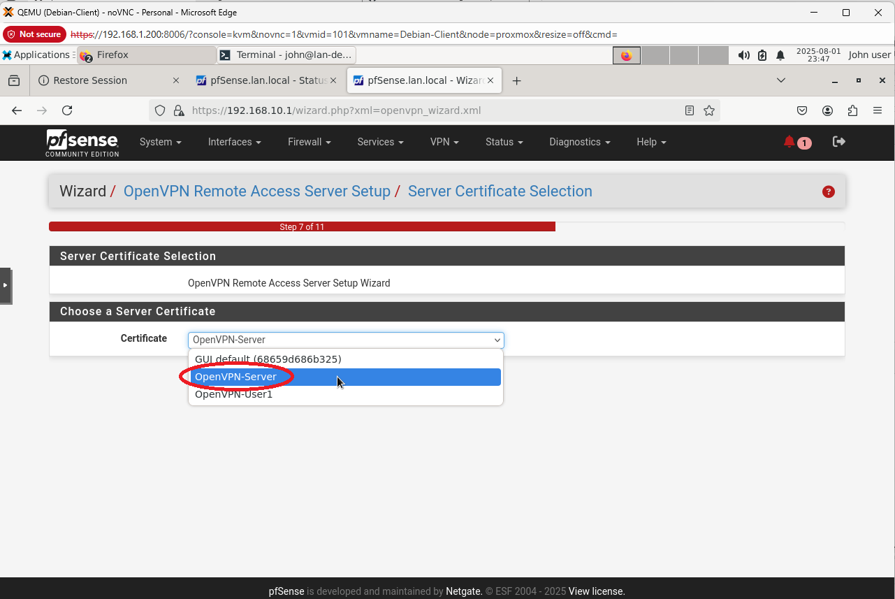

# 🛡️ OpenVPN Setup on pfSense — Step-by-Step Guide

This guide walks through setting up an OpenVPN server on **pfSense** and connecting a Windows client. Each section is meant to be documented with screenshots alongside the steps.

---

## 📍 1. Create a Certificate Authority (CA)

Navigate to:  
**`System > Certificates > Authorities`**

1. Click ➕ **Add**


2. Set:
   - **Descriptive Name:** `OpenVPN-CA`
   - **Method:** `Create an internal Certificate Authority`
   - **Key Length:** `2048` or `4096`
   - **Digest Algorithm:** `SHA256`
   - Fill out country, state, etc.
3. Click **Save**


---

## 📍 2. Create the Server Certificate

Navigate to:  
**`System > Certificates > Certificates`**

1. Click ➕ **Add/Sign**


2. Set:
   - **Method:** `Create an internal certificate`
   - **Descriptive Name:** `OpenVPN-Server`
   - **Certificate Authority:** `OpenVPN-CA`
   - **Type:** `Server Certificate`
   - **Common Name:** `OpenVPN-Server`

3. Click **Save**


---

## 📍 3. Create a User Certificate

Still under **Certificates > Certificates**:

1. Click ➕ **Add/Sign**
2. Set:
   - **Method:** `Create an internal certificate`
   - **Descriptive Name:** `OpenVPN-User1`
   - **Certificate Authority:** `OpenVPN-CA`
   - **Type:** `User Certificate`
   - **Common Name:** `user1`
3. Click **Save**


---

## 📍 4. Run the OpenVPN Wizard

Navigate to:  
**`VPN > OpenVPN > Wizards`**


Follow these steps:

1. **Type:** `Local User Access`
   


2. **CA:** Select `OpenVPN-CA`


5. **Server Certificate:** `OpenVPN-Server`
6. **Interface:** `WAN`
7. **Protocol:** `UDP`, Port `1194`
8. **Tunnel Network:** `10.8.0.0/24`
9. **Local Network:** `192.168.10.0/24` (or your VLAN10 subnet)




3. **Client Settings:** (Optional DNS options)
4. **Firewall Rules:** ✔️ `Auto-create`


Click **Finish**

---

## 📍 5. Export the OpenVPN Client Configuration

Go to:  
**`VPN > OpenVPN > Client Export`**

> 🔸 If you don't see this menu, install the package:
> `System > Package Manager > Available Packages`  
> Search for `openvpn-client-export`, then click **Install**

### Once Installed:
1. Scroll to the **OpenVPN Clients** section
2. Look for your user (e.g., `vpnuser`)
3. Choose export type:
   - Windows Installer (64-bit)
   - Archive (.zip)
   - Inline Config (.ovpn)

---

## 📍 6. Install OpenVPN on the Client (Windows)

1. Download and install [OpenVPN GUI for Windows](https://openvpn.net/community-downloads/)
2. Double-click the downloaded **Windows Installer** (from the export)
3. Right-click the **OpenVPN GUI** tray icon
4. Click **Connect**
5. When prompted:
   - **Username:** `vpnuser`
   - **Password:** (set in pfSense)

Once connected:
- ✅ You should be assigned an IP (e.g., `10.8.0.2`)
- ✅ You should be able to ping internal devices in allowed subnets

---

## 🔁 Fix: Missing Users in Export List

### Step 1: Create a User with Linked Certificate

1. Go to: `System > User Manager > Users`
2. Click **Add**
3. Fill in:
   - **Username:** `vpnuser`
   - **Password:** (strong)
   - Under **Certificate**, select `OpenVPN-User1`
4. Click **Save**

### Step 2: Return to Client Export

1. Go to `VPN > OpenVPN > Client Export`
2. Scroll down — user `vpnuser` should now appear
3. Export Windows Installer or .ovpn file

---

## ✅ Post-Connection Testing

After connecting from a client device:

```bash
ping 192.168.10.101  # Debian Admin VM ✅
ping 192.168.20.102  # Windows Server ❌ (until firewall allows it)
```

---

## 🧹 Uninstall or Clean Up

### To Remove VPN Setup from Client VM:

1. Uninstall **OpenVPN GUI** via `Apps & Features`
2. Delete config files from:
   - `C:\Program Files\OpenVPN\config\`
   - `C:\Users\<YourUser>\OpenVPN\config\`

### To Delete on pfSense:

1. **VPN > OpenVPN > Servers** — Delete the VPN server
2. **System > Certificates** — Delete server & user certs
3. **System > Certificate Authorities** — Delete CA (if not reused)
4. **System > User Manager > Users** — Delete user

