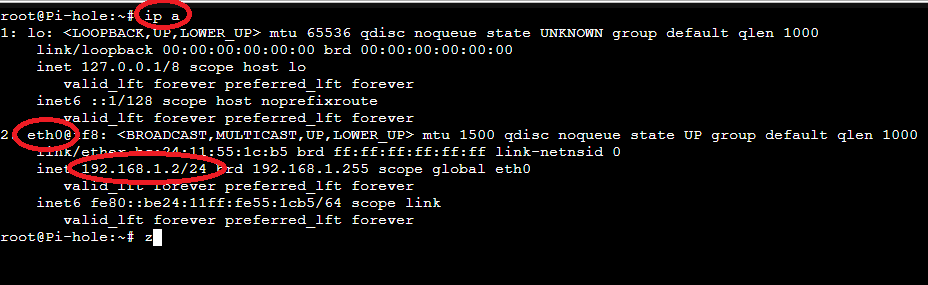
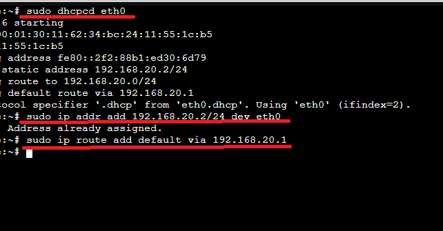

# 🧩 Pi-hole DNS Server Configuration (VLAN 20)

This guide documents how to fix and configure the Pi-hole container/VM to serve as the DNS server for **VLAN 20** and other VLANs in the Proxmox lab.

## 📌 Problem

Pi-hole VM was originally assigned the wrong IP address: `192.168.1.2` (outside target VLAN).  
We wanted Pi-hole to use `192.168.20.2` to serve as the DNS server for All the VLANs but targeted for VLAN 20 — the same subnet as the Windows client and Debian admin VM.

## 🔍 Initial Troubleshooting

- Ran `ip a` on the Pi-hole console.
- Verified the interface in use was `eth0`.
- Saw the current IP was incorrect (`192.168.1.2`).
  

---

## 🧪 Temporary IP Fix (Manual Command-Line Change)

1. Manually changed IP address (not via /etc/network or Netplan, but directly):
  -sudo dhcpcd eth0
  -sudo ip addr add 192.168.20.2/24 dev eth0
  -sudo ip route add default via 192.168.20.1

2. Confirm change with 'ip a'

