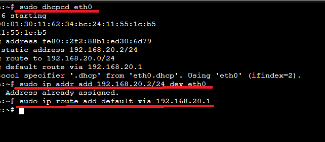
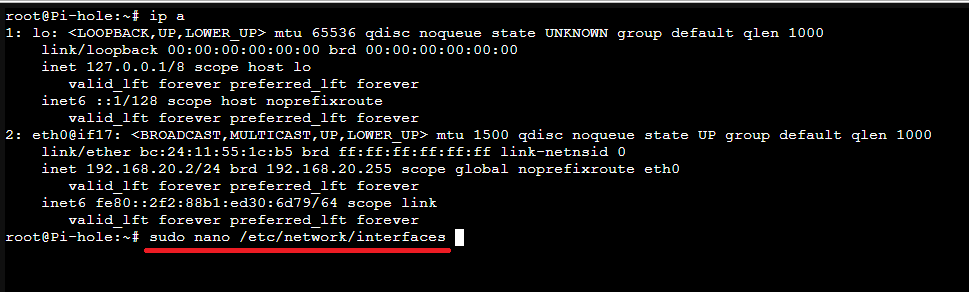
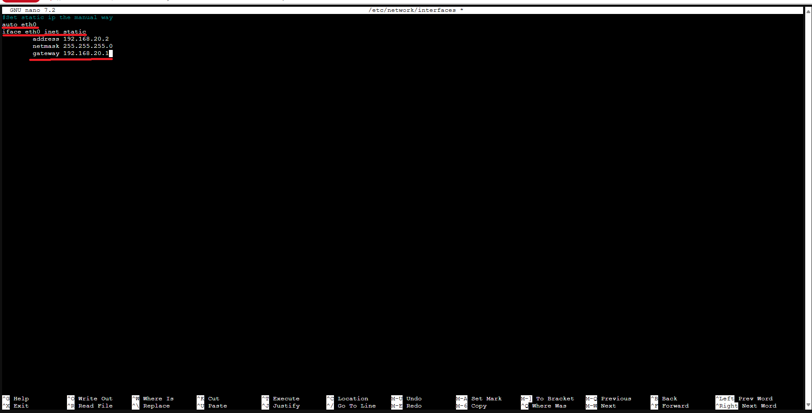
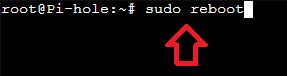
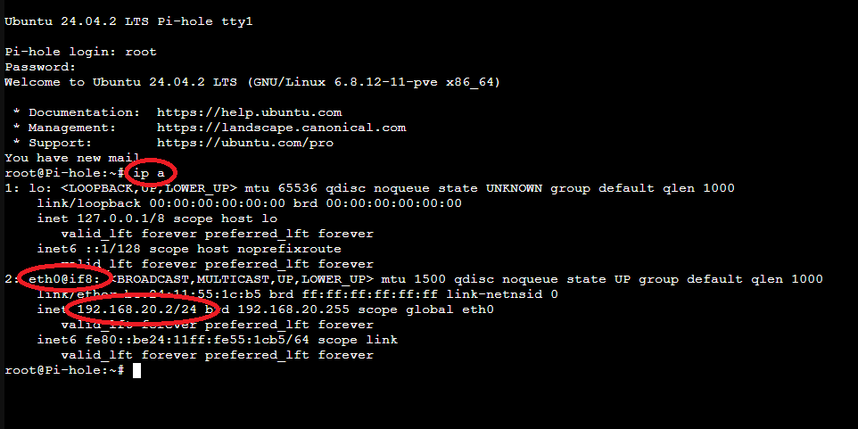
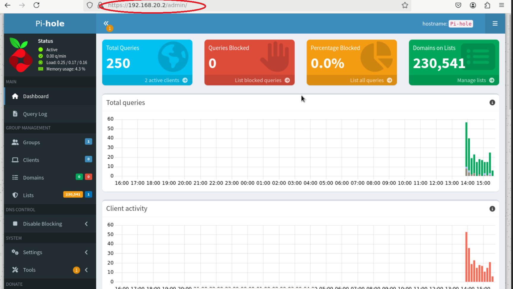
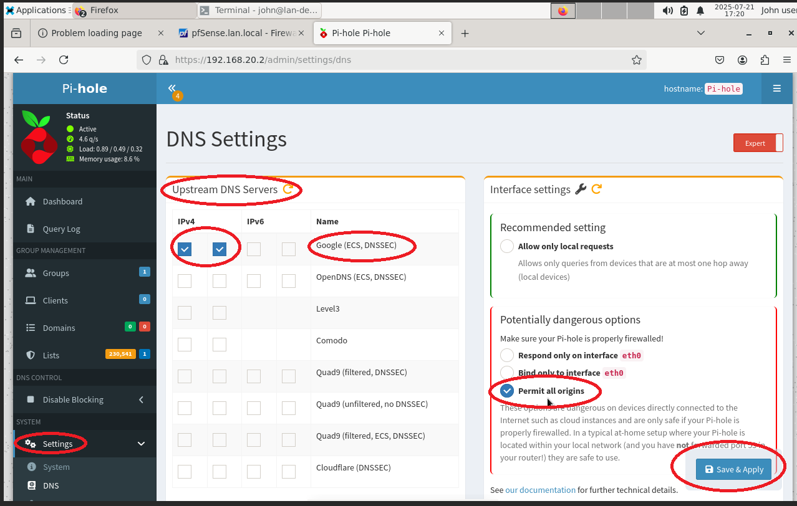
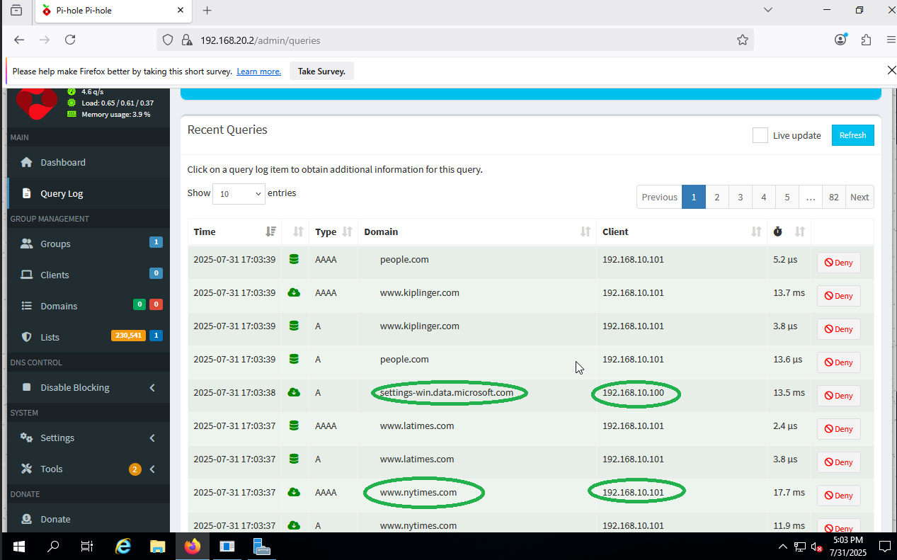
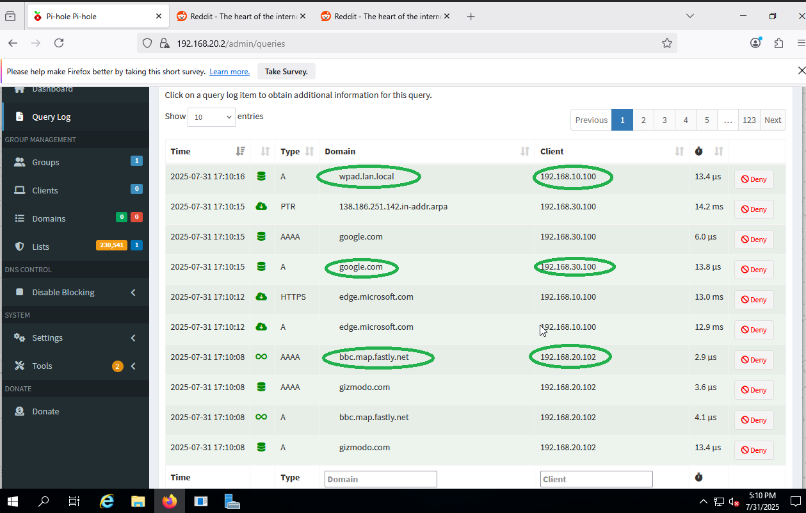
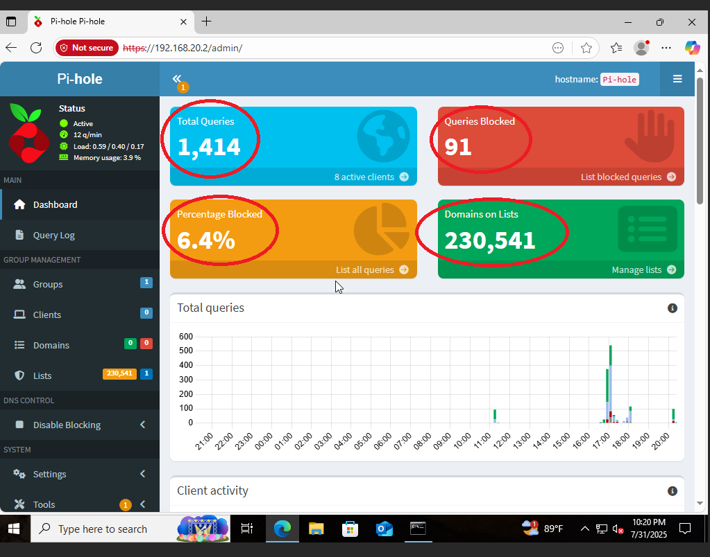

# Step 6: 🧩 Pi-hole DNS Server Configuration (VLAN 20)

This documentation outlines how to configure the Pi-hole container/VM as the DNS server for **VLAN 20** in your Proxmox lab environment. The steps also cover troubleshooting and fixing an incorrect IP address assignment.

---

## 📚 Table of Contents

- [📌 Problem Overview](#-problem-overview)
- [🔍 Initial Troubleshooting](#-initial-troubleshooting)
- [🧪 Temporary IP Fix (Manual Command-Line Change)](#-temporary-ip-fix-manual-command-line-change)
- [💾 Make IP Assignment Permanent](#-make-ip-assignment-permanent)
  - [📝 Edit the interfaces file](#-edit-the-interfaces-file)
  - [✏️ Add the following configuration](#-add-the-following-configuration)
- [✅ Confirm Connectivity to Pi-hole Dashboard](#-confirm-connectivity-to-pi-hole-dashboard)
- [🔄 Ensure Pi-hole Can Answer Redirected Traffic and Set Upstream DNS Servers](#-ensure-pi-hole-can-answer-redirected-traffic-and-set-upstream-dns-servers)
- [📊 Pi-hole Query Log Demonstration](#pi-hole-query-log-demonstration)
- [📈 Pi-hole Dashboard Display](#pi-hole-dashboard-display)

---
## 📌 Problem Overview

The Pi-hole VM was initially assigned an incorrect IP address: `192.168.1.2`, which is not part of VLAN 20.

✅ **Goal:** Assign the correct static IP `192.168.20.2` to the Pi-hole VM to ensure it can function properly as the DNS server for VLAN 20 (alongside the Windows client and Debian Admin VM).

---

## 🔍 Initial Troubleshooting

1. Logged into the Pi-hole VM console.
2. Ran `ip a` and confirmed:
   - Active interface: `eth0`
   - Incorrect IP: `192.168.1.2`
  


---


## 🧪 Temporary IP Fix (Manual Command-Line Change)

Manually changed IP address (not via /etc/network or Netplan, but directly):
```bash
sudo dhcpcd eth0
sudo ip addr add 192.168.20.2/24 dev eth0
sudo ip route add default via 192.168.20.1
```


---

### 💾 Make IP Assignment Permanent

To make the Pi-hole IP assignment persistent across reboots, manually edit the network interface configuration file:

### 📝 Edit the interfaces file:

- **sudo nano /etc/network/interfaces**
> 📝 Note: This guide assumes you're using a Debian-based system where `/etc/network/interfaces` is used instead of Netplan.



### ✏️ Add the following configuration:

```ini
auto eth0
iface eth0 inet static
  address 192.168.20.2
  netmask 255.255.255.0
  gateway 192.168.20.1
```
> 🔁 Restart networking or reboot:
> ```
> sudo systemctl restart networking
> ```
> or just:
> ```
> sudo reboot
> ```
 
 

- **Confirm change with 'ip a'**



### ✅ Confirm Connectivity to Pi-hole Dashboard  

Access the Pi-hole Dashboard from the Debian Admin Machine (VLAN10) using the Pi-hole IP: `192.168.20.2`



---

### 🔄 Ensure Pi-hole Can Answer Redirected Traffic and Set Upstream DNS Servers 

To allow Pi-hole to properly resolve redirected DNS queries (those not originally intended for Pi-hole), follow these steps:

1. Open the Pi-hole Admin Dashboard.
2. Navigate to **Settings** → **DNS**.
3. Under **Interface listening behavior**, select:  
   > **Listen on all interfaces, permit all origins**
   > This setting ensures Pi-hole accepts DNS queries coming from clients in **other VLANs**, not just from its own subnet.
4. Under **Upstream DNS Servers**, ensure the following is selected:  
   - ✅ Google DNS (8.8.8.8 and 8.8.4.4)
   -  ✅ ECS and DNSSEC: Enable for enhanced privacy and security



This setup allows Pi-hole to accept DNS queries redirected from other servers (e.g., `8.8.8.8`, `1.1.1.1`) and forward queries securely to Google DNS with ECS and DNSSEC enabled.

---

## Pi-hole Query Log Demonstration

The following screenshots show DNS query logs captured by Pi-hole from various devices across VLANs, confirming proper DNS resolution and traffic monitoring.

- 🪟 192.168.10.100 – Windows 10 Client (VLAN 10)
- 🐧 192.168.10.101 – Debian Admin Machine (VLAN 10)
- 🧪 192.168.30.100 – Kali Linux (VLAN 30)
- 🖥️ 192.168.20.102 – Windows Server 2019 (VLAN 20)

### Queries from 192.168.10.100 and 192.168.10.101


### Queries from 192.168.30.100 and 192.168.20.102


---

## Pi-hole Dashboard Display

The screenshot below highlights key Pi-hole metrics, including:

- **Total DNS Queries**
- **Queries Blocked**
- **Percentage Blocked**
- **Domains on Blocklists**

These metrics are circled in red for clarity and help demonstrate that DNS filtering is active and functioning as expected.


