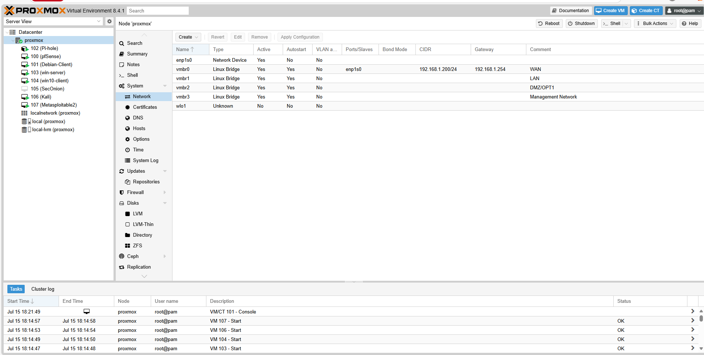

### Step 1: Proxmox – Before Editing vmbr1

Navigated to **Datacenter > Node > System > Network**

1. Selected `vmbr1`
2. Enabled the **VLAN Aware** option
3. Clicked **Apply Configuration**
4. Restarted network services if prompted

