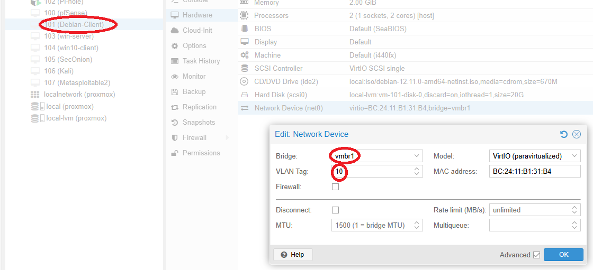

### Step 1: Proxmox – Editing vmbr1 for VLAN Awareness
Navigated to **Datacenter > Node > System > Network**

### Before Editing
In the original configuration, `vmbr1` was not set to support VLANs.

---

### Enabling VLAN Awareness

Selected **vmbr1**, then enabled the **VLAN Aware** checkbox to allow VLAN-tagged traffic to pass through.

> 💡 This setting is crucial for allowing Proxmox to bridge VLAN-tagged traffic across virtual machines and physical interfaces.
---
✅ Click **Apply Configuration** after making the change.

---
### Confirming VLAN Awareness is Enabled

Checked that **vmbr1** now shows **VLAN Aware: Yes**.

---
---

## Step 2: Assign VLAN Tags to Virtual Machines

With `vmbr1` now VLAN-aware, each VM must be assigned a VLAN tag that matches its intended network segment.

This setup uses the following VLAN structure: **VLAN 10 (Client)**, **VLAN 20 (Server)**, **VLAN 30 (Security)**.
| VM Name         | VLAN Tag | Purpose              |
|------------------|----------|-----------------------|
| Debian-Admin     | 10       | Management / Admin VM |
| Windows 10       | 10       | Management / User VM  |
| Windows Server   | 20       | Infrastructure        |
| Pi-hole          | 20       | Network DNS Filtering |
| Metasploitable   | 20       | Vulnerable Target     |
| Kali Linux       | 30       | Penetration Testing   |
| Security Onion   | 30       | IDS / Network Monitor |

---

### Assigning VLAN Tag to Debian-Admin and Windows 10 (VLAN 10)

1. Open **Debian-Admin VM** > **Hardware** > **Network Device**
2. Click **Edit** on the network interface.
3. Set:
   - **Bridge**: `vmbr1`
   - **VLAN Tag**: `10`

✅ Repeat for **Windows 10** with the same settings.

---

### Assigning VLAN Tag to Windows Server, Pi-hole, and Metasploitable (VLAN 20)

1. Open each VM one at a time (Windows Server, Pi-hole, Metasploitable).
2. Navigate to **Hardware > Network Device** > **Edit**
3. Set:
   - **Bridge**: `vmbr1`
   - **VLAN Tag**: `20`

---

### Assigning VLAN Tag to Kali Linux and Security Onion (VLAN 30)

1. Open **Kali Linux** and **Security Onion** VMs.
2. Edit their network interfaces to set:
   - **Bridge**: `vmbr1`
   - **VLAN Tag**: `30`

### Security Onion Configuration
- **ens18**(connected to 'vmbr1') is **tagged VLAN 30** → used for Management + Monitoring.
- **ens19**(connected to vmbr2) is **not tagged** and has **no IP address** → used only for passive sniffing.
- Do *NOT* assign vlan or IP to **ens19**. It is used only for *raw packet capture and must remain untagged*.

> 🔁 Repeat these steps for any additional VMs that require network segmentation.

