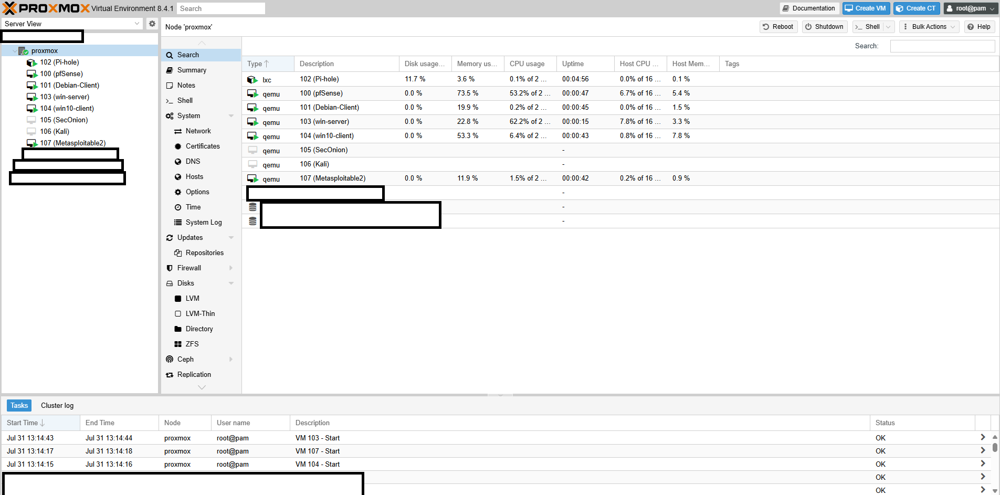
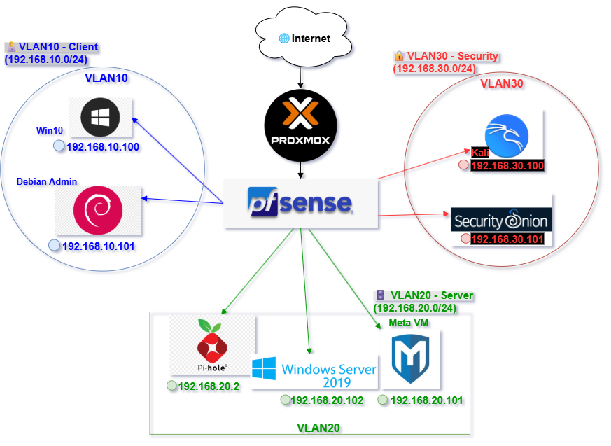

# 🧪 Proxmox Networking & Security Lab
**Enterprise Simulation: VLAN Segmentation | DNS Configuration | Firewall Rules | Windows & Linux Configuration**

  

A virtual home lab designed to simulate an enterprise network environment using:
> **Proxmox VE**, **pfSense**, **Windows Server 2019**, **Windows 10**, **Security Onion**, **Kali Linux**, **Debian Admin**, **Pi-hole**, and **Metasploitable2**

---

### 🔍 Lab Highlights

- 🔐 VLAN segmentation and inter-VLAN firewall rules
- 🌐 DNS redirection and filtering with Pi-hole
- 🧰 IDS-ready architecture using Security Onion
- ⚙️ Multi-VM configuration for security monitoring and testing environments

---

## 🖥️ Proxmox Dashboard

*Primary hypervisor interface hosting all virtual machines.*

---

## 🌐 Network Topology Diagram

*Visual overview of VLANs, pfSense trunking, and host placement.*

> 🔧 Created with [draw.io]

---

## 🧱 Lab Topology Overview

- **Proxmox VE** with `vmbr0` (WAN) and `vmbr1` (LAN)
- **pfSense** as router/firewall using VLAN trunking
- **Pi-hole** for DNS filtering and ad blocking
- VLANs used to segment Clients, Servers, and Security Zones
- Multiple VMs simulating real-world enterprise roles

---

## 🖥️ Virtual Machines

| VM Name             | Role                            | OS / Description                     |
|---------------------|----------------------------------|--------------------------------------|
| Proxmox             | Lab Hypervisor                   | Proxmox VE                           |
| pfSense             | VLAN Routing & Firewall          | pfSense CE                           |
| Windows 10 Client   | End-user Testing Environment     | Windows 10 Pro                       |
| Windows Server 2019 | Active Directory / File Sharing  | Windows Server 2019                  |
| Debian Admin        | Network Admin Workstation        | Debian Linux                         |
| Kali Linux          | Penetration Testing Tools        | Kali Rolling                         |
| Meta (CentOS)       | Vulnerable VM for Exploitation   | Metasploitable 2                     |
| Pi-hole             | DNS Sinkhole & Ad Blocker        | Pi-hole in Ubuntu Container          |
| Security Onion      | Intrusion Detection / Monitoring | Security Onion (SO2)                 |

---

## 🌐 VLAN Configuration

| **VLAN ID** | **Name / Purpose** | **Subnet**        | **Assigned VMs and IP Addresses**                                       |
|------------:|--------------------|-------------------|-------------------------------------------------------------------------|
| 10          | **Client**         | 192.168.10.0/24   | 🖥️ Windows 10 Client – `192.168.10.100`    🧑‍💼 Debian Admin Station – `192.168.10.101`|
| 20          | **Server**         | 192.168.20.0/24   | 🗂️ Windows Server 2019 – `192.168.20.102`    💻 Meta VM – `192.168.20.101`   🍍 Pi-hole – `192.168.20.2` |
| 30          | **Security**       | 192.168.30.0/24   | 🛡️ Kali Linux – `192.168.30.100`    📡 Security Onion – `192.168.30.101`|

---

## 🔧 Key Features

- VLAN segmentation and inter-VLAN routing via pfSense
- Role-based firewall rules using pfSense
- Central DNS filtering using Pi-hole with NAT redirection
- Configured to support simulated attacker and victim VMs for security testing
- IDS monitoring with Security Onion
- Network troubleshooting across Windows and Linux hosts

---

## 📝 Documentation

Each VM and configuration is documented in its own folder:

- [`Proxmox`](./Proxmox/README.md)
- [`pfSense`](./pfSense/README.md)
- [`Pi-hole`](./Pi-hole/README.md)
- [`Windows 10 Client`](./Win10_Client/README.md)
- [`Windows Server 2019`](./WinServer2019/README.md)
- [`Debian Admin`](./Debian_Admin/README.md)
- [`Kali Linux`](./Kali_Linux/README.md)
- [`Meta`](./Meta/README.md)
- [`Security Onion`](./SecurityOnion/README.md)
- [`Troubleshooting`](./Troubleshoot/README.md)

Each subfolder includes:
> 📸 **Screenshots** of VM settings, firewall rules, alerts, Pi-hole logs, and more.

---

## 🔐 VLAN Segmentation & Firewall Rules

- pfSense is configured as a VLAN trunk to manage traffic across VLAN 10 (Client), VLAN 20 (Server), and VLAN 30 (Security)
- Inter-VLAN communication is controlled via **stateful firewall rules**, ensuring least privilege
- VLANs are assigned based on VM role, with unique IP ranges and DHCP scopes

## 🌐 DNS Filtering with Pi-hole
- Pi-hole deployed in the Server VLAN (192.168.20.2) as the default DNS resolver
- DNS traffic from all VLANs is redirected to Pi-hole using pfSense NAT port redirection
- Logs and dashboards show DNS query sources and blocked domains
- Custom blocklists and whitelists configured for fine-grained DNS control

---

## 🎯 Skills Demonstrated

- Virtualization using Proxmox  
- VLAN design and inter-VLAN routing  
- DNS/NAT configuration using pfSense & Pi-hole  
- Security monitoring via Security Onion  
- Network management across Windows & Linux  
- Documentation and Troubleshooting systems

---

## 🔐 VPN Access

- Configured **OpenVPN server** on pfSense to allow remote access to VLAN10 (192.168.10.0/24).
- Created and exported **user certificate** using pfSense’s Cert Manager.
- Connected from external WinServer VM using **OpenVPN client**.
- Verified access:
  - ✅ Access to Debian Admin (192.168.10.101)

**Screenshots:**
-[OpenVPN](./OpenVPN/README.md)
