# 🧅 Security Onion (VLAN 30)

## 🔧 Network Configuration

- **VLAN**: 30  
- **Interface**: `ens18`  
- **IP Address**: 192.168.30.101 (DHCP)  
- **Gateway**: 192.168.30.1  
- **DNS**: 192.168.20.2 (Pi-hole)

---

## 🔍 Network Verification Commands

| Test                        | Command                                 | Expected Output                         |
|-----------------------------|------------------------------------------|-----------------------------------------|
| Show IP address             | `ip a`                                   | IP: `192.168.20.101`                    |
| Show route                  | `ip r`                                   | Default via `192.168.20.1`              |
| Ping Gateway                | `ping -c 4 192.168.30.1`                 | Replies received                        |
| Ping DNS Server             | `ping -c 4 192.168.20.2`                 | Replies received                        |
| Ping Meta                   | `ping -c 4 192.168.20.101`               | Successful response from Meta           |
| DNS Resolution              | `dig google.com` or `nslookup google.com`| Successful DNS result                   |

---

## 📸 Suggested Screenshot Checklist

- `ip a` and `ip r` output

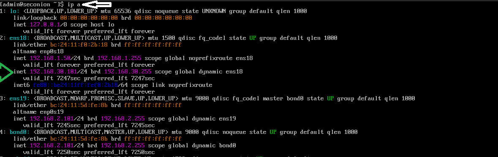
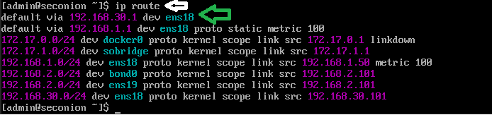

- `ping` to gateway, DNS, and Meta

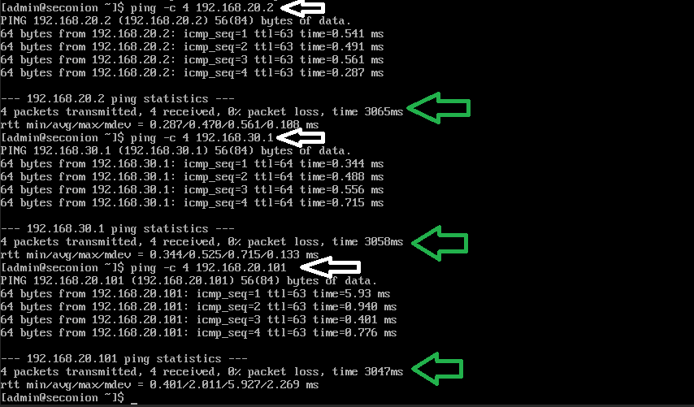

- DNS test using `dig` or `nslookup`  

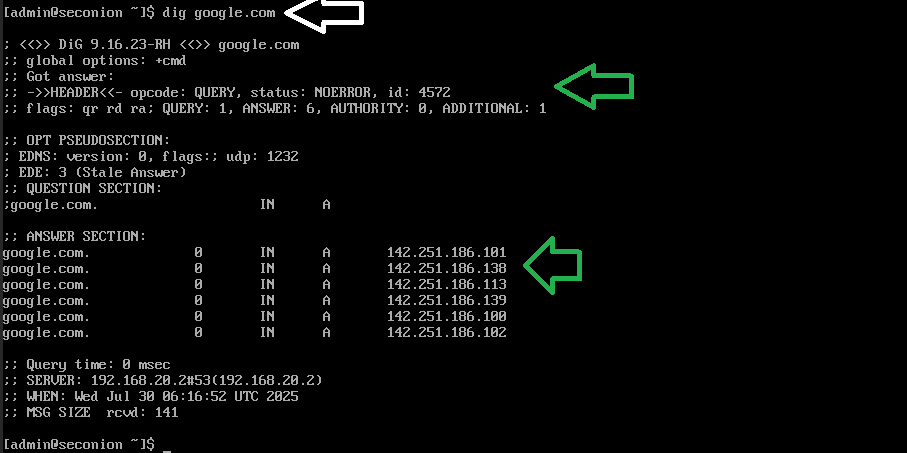
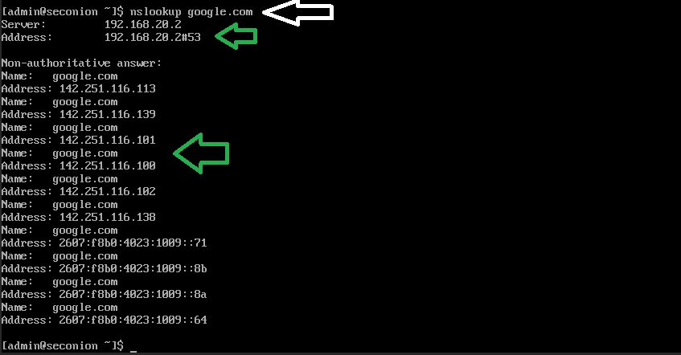

---

## Security Onion: Integrated Tools

Security Onion offers several powerful tools pre-configured for log collection, analysis, and forensic triage. Below are screenshots from various modules included in the Elastic stack and supporting toolset.

### Kibana
Kibana is the main UI for visualizing and querying logs.
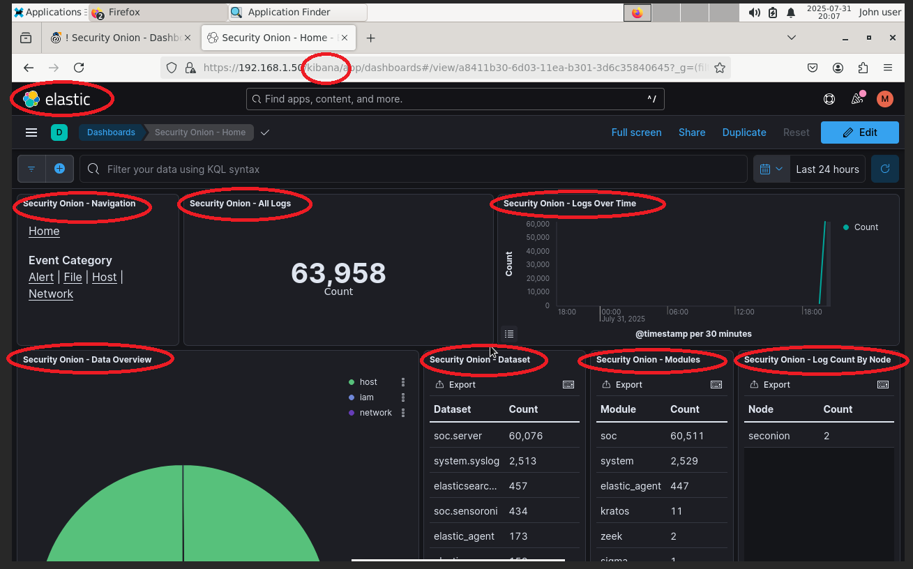

### Elastic Fleet & Agents
Fleet tracks connected agents and their health.
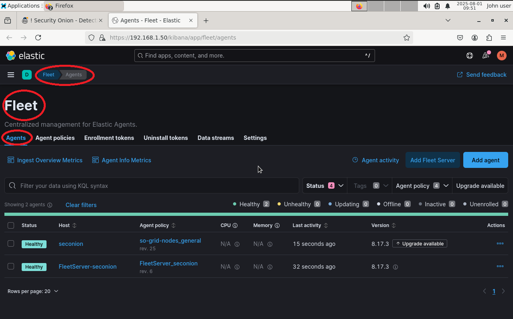
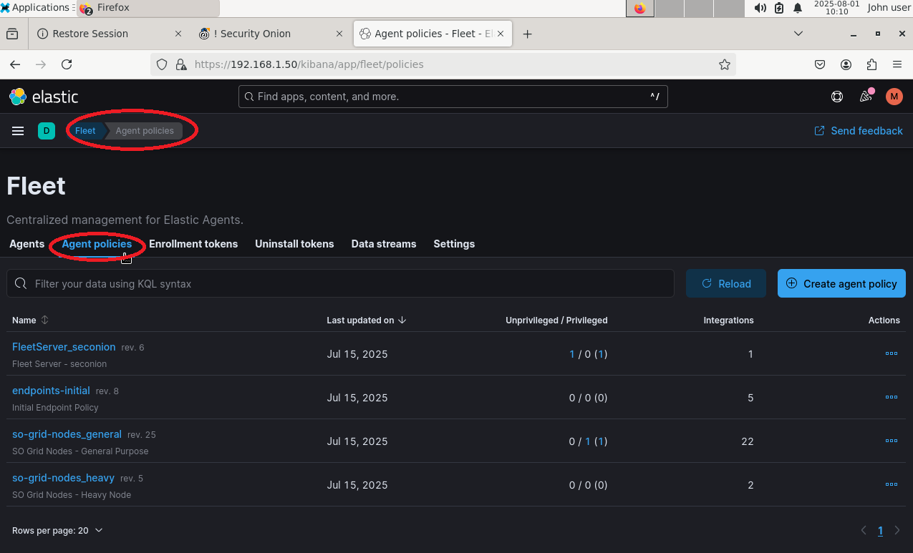

### Osquery Manager
Used for live queries and endpoint inspection.
*Note: No queries have been executed in this lab instance.*
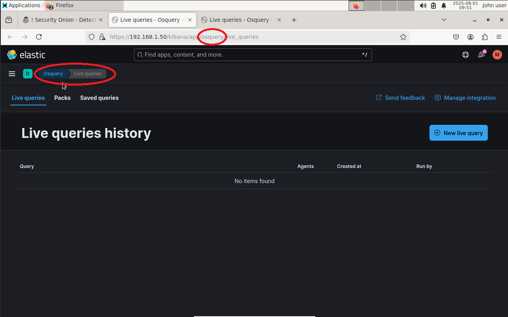

### Wazuh
Wazuh integration for host intrusion detection. Currently shows zero logs — confirming no endpoint agent is reporting.
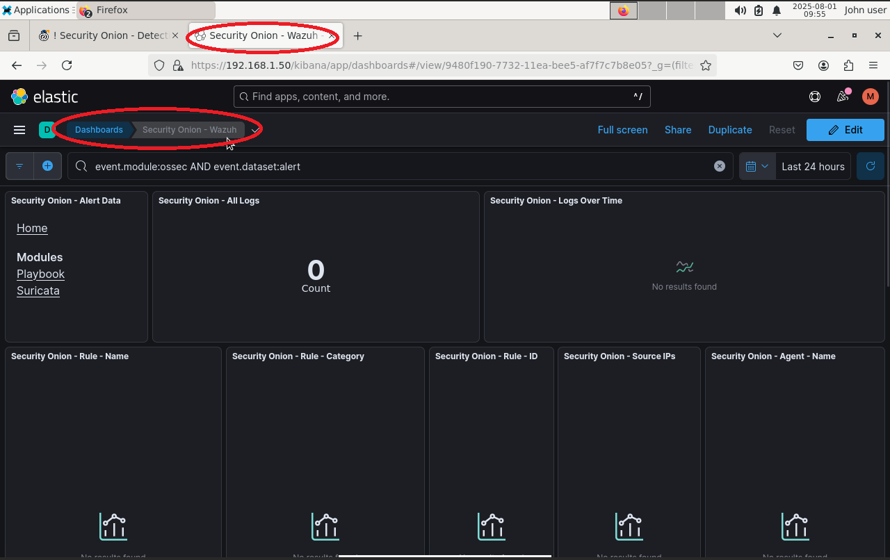

### CyberChef
The "Cyber Swiss Army Knife" for data decoding and manipulation.
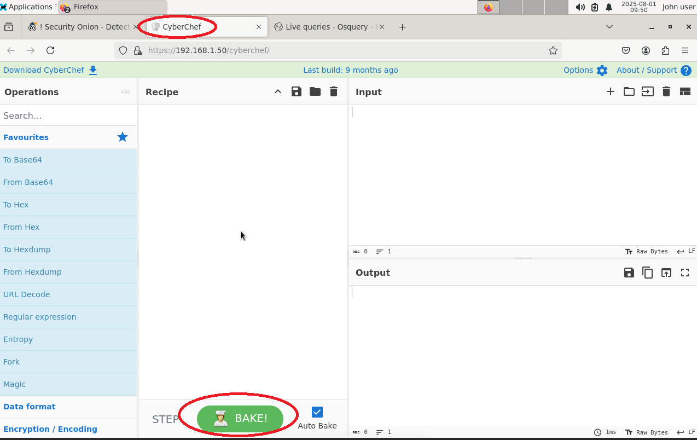

### ATT&CK Navigator
Visual map of adversary techniques using MITRE ATT&CK framework.
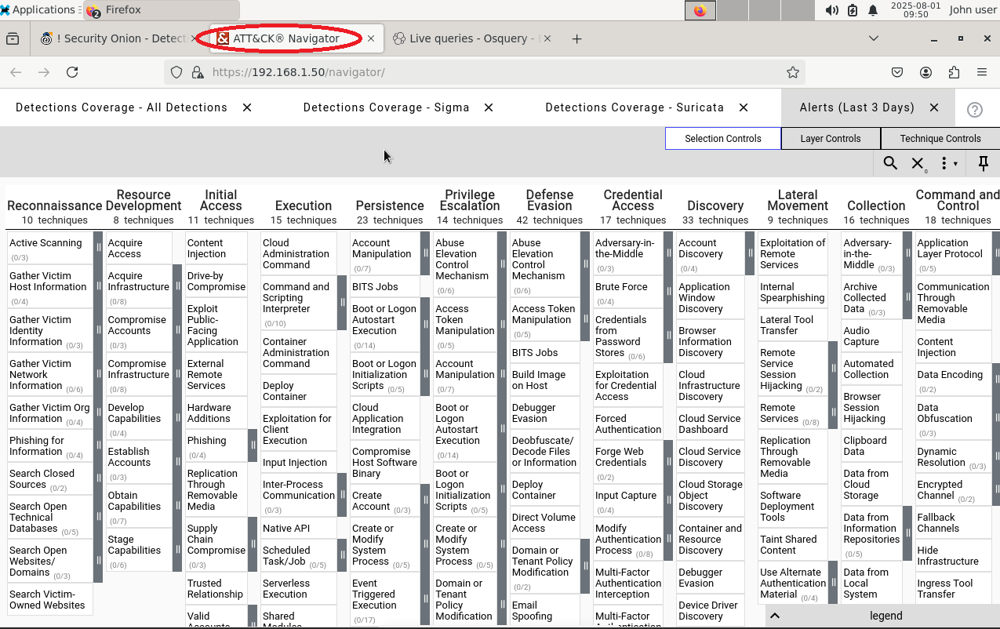

### InfluxDB
Database for time-series data, used for telemetry and metrics.
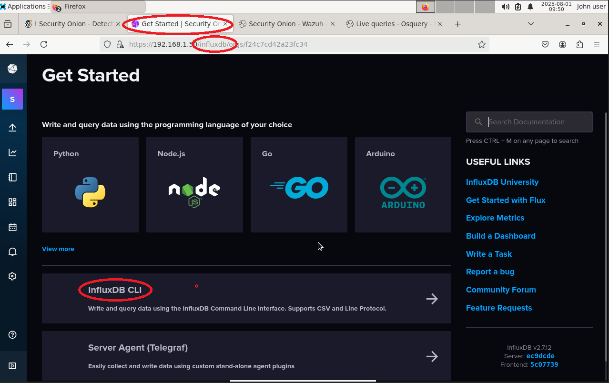
