# 🛠️ Troubleshooting DNS and Pi-hole Issues

## ❌ Problem Overview

Client devices and the Pi-hole server were unable to resolve domain names.

### 🔎 Symptoms
- `nslookup` and `dig` failed with timeouts  
- `curl` returned “Could not resolve host”  
- Pi-hole dashboard showed upstream DNS and NTP errors  
- DHCP worked (clients received IP addresses), but **no DNS resolution**  

---

## 🧠 Root Cause:

The **pfSense NAT Port Forward rule** redirected all DNS traffic (port 53) to the Pi-hole — including traffic **originating from the Pi-hole itself**.

Because the rule **did not exclude** the Pi-hole's IP (`192.168.20.2`), it caused a **DNS loopback**, preventing Pi-hole from contacting its upstream DNS servers (e.g., `8.8.8.8`).

**Additional contributing factors:**

- `/etc/resolv.conf` pointed to `127.0.0.1`
- DNSSEC was enabled, adding further resolution failures

---

## ✅ Resolution Steps

### 🔧 1. Fix pfSense NAT Port Forward Rules
- Add **"Invert Match"** to the source IP for each VLAN rule  
  ➤ This prevents Pi-hole’s own queries from being caught in the redirect loop.

#### VLAN 10


#### VLAN 20
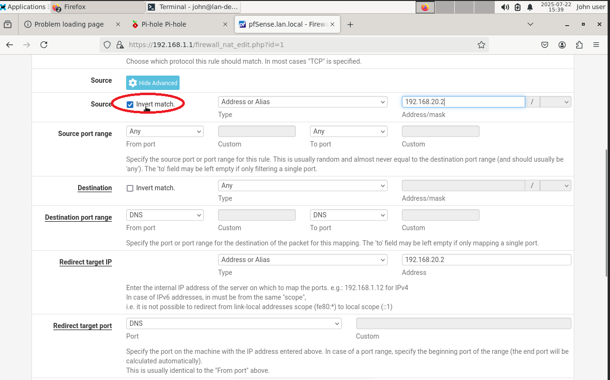

#### VLAN 30
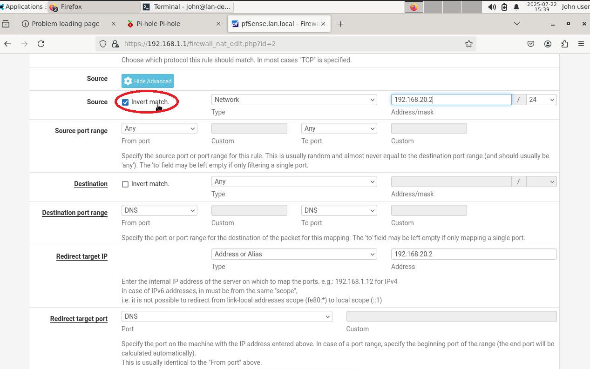

---

### ⚙️ 2. Update Pi-hole DNS Settings

- Enter Pihole's DNS setting and Set upstream DNS (e.g., Google `8.8.8.8`, Cloudflare `1.1.1.1`)
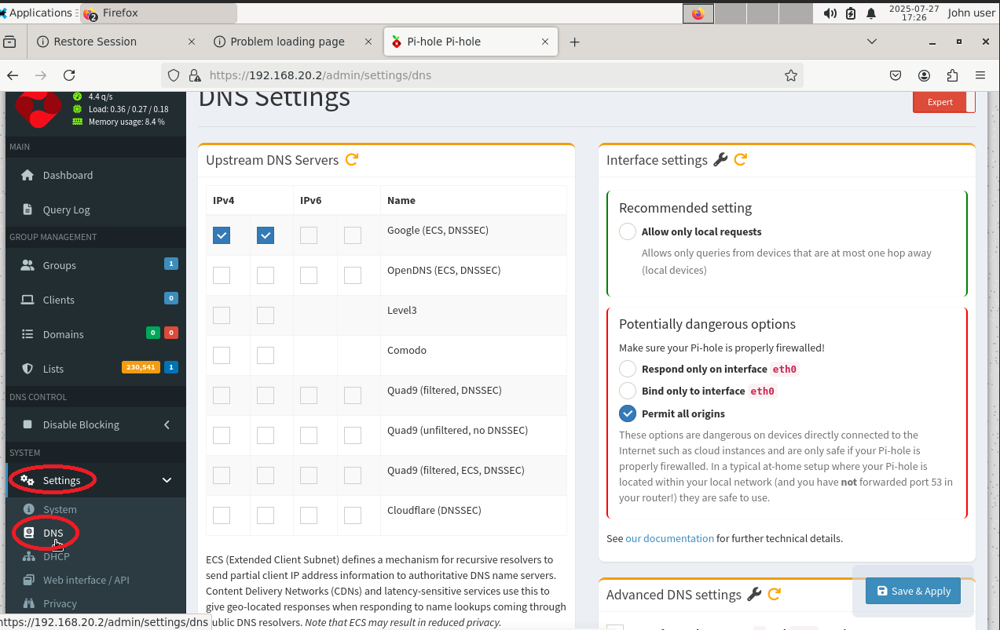


- Disable DNSSEC:  
   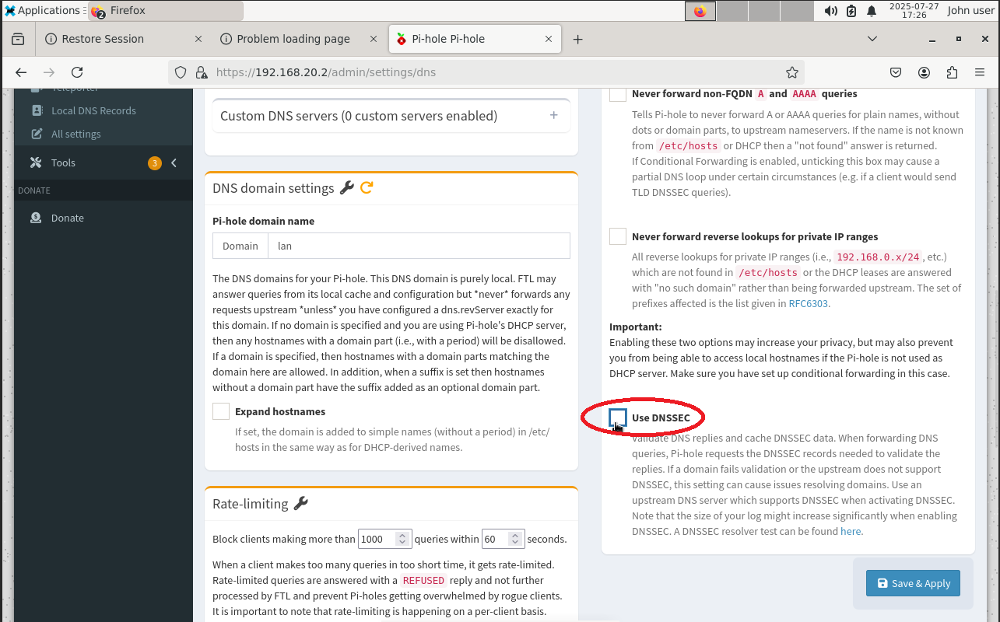

---

### 🖥️ 3. Update `/etc/resolv.conf` on Pi-hole
  ```bash
sudo nano /etc/resolv.conf
# Replace contents with:
nameserver 1.1.1.1
nameserver 8.8.8.8
```
   Press CTRL + O to save the file ("Write Out")
   Press Enter to confirm the filename
   Press CTRL + X to exit nano

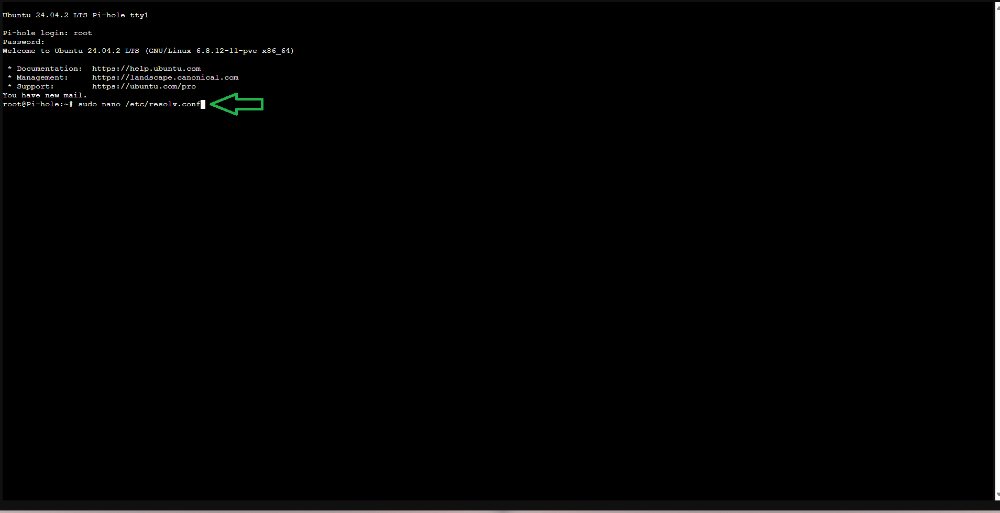
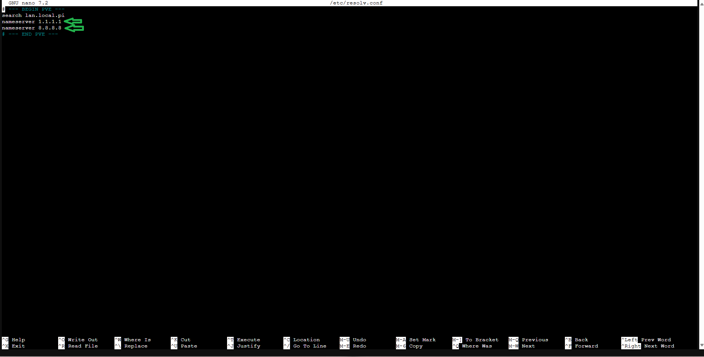

---

# DNS Resolution Test (Before and After NAT Invert Match Fix)

This folder documents how DNS resolution was affected when the NAT redirect rules for DNS traffic were **not** excluding the Pi-hole (`192.168.20.2`) via "Invert Match."

---

## 🔧 Problem Summary

When **"Invert match"** was **unchecked** in the NAT Port Forward rule:

- All DNS traffic, including Pi-hole’s own queries, was redirected back to itself.
- This caused Pi-hole to fail DNS resolution because it could not reach upstream DNS (like 8.8.8.8).
- As a result, **clients in all VLANs could not resolve domain names**.

---

## 🧪 DNS Testing Tools (Before vs After Fix)

The following commands were used in each VMs console to confirm DNS status from clients:

```bash
nslookup google.com
dig google.com
curl https://www.google.com
```

### 🔴 Before Fix:

- All tools failed across all client VMs
- Pi-hole unable to reach upstream DNS

---

- Windows 10 Client (timeout)
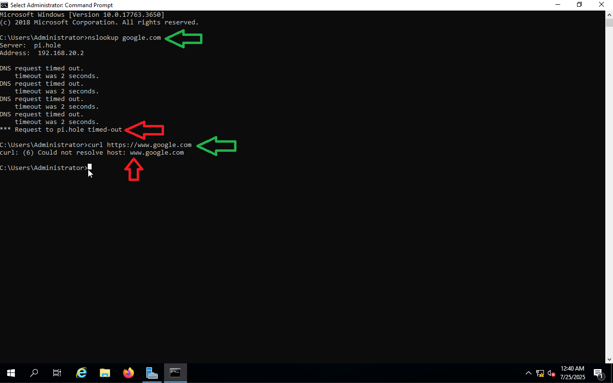

- Debian Admin Workstation (timeout)
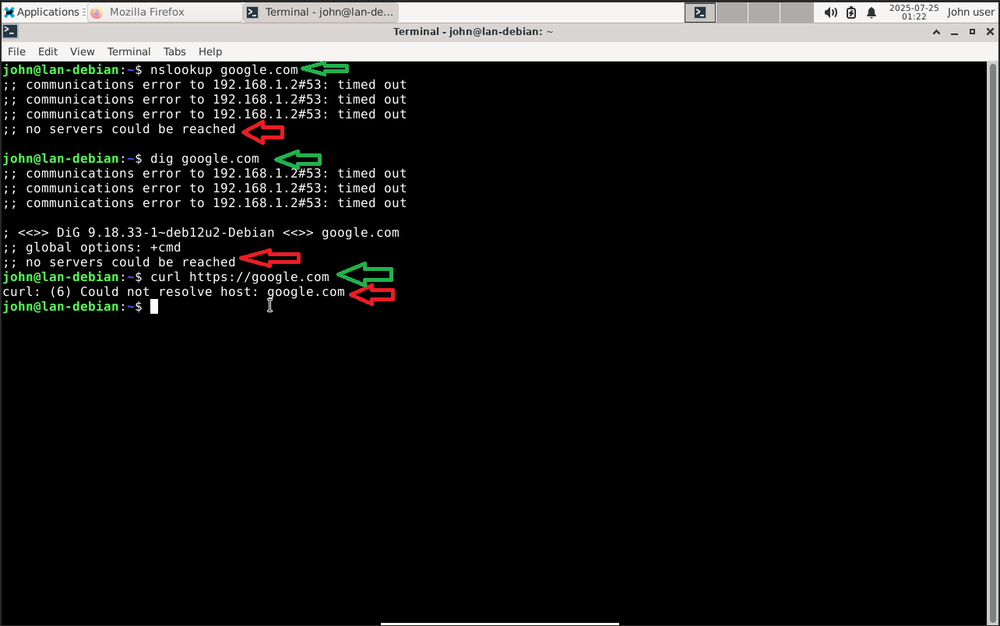


- Windows Server 2019 (timeout)


- Metasploitable 2 (timeout)

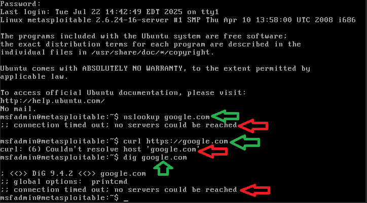


- Pihole (timeout)

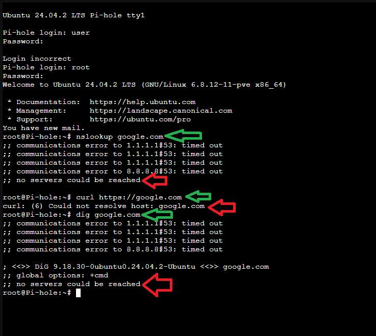


- Kali Linux (timeout)
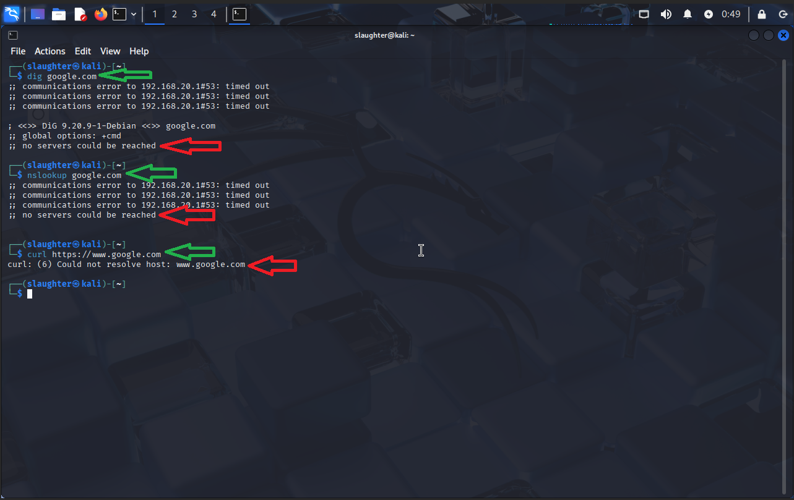


- Security Onion (timeout)
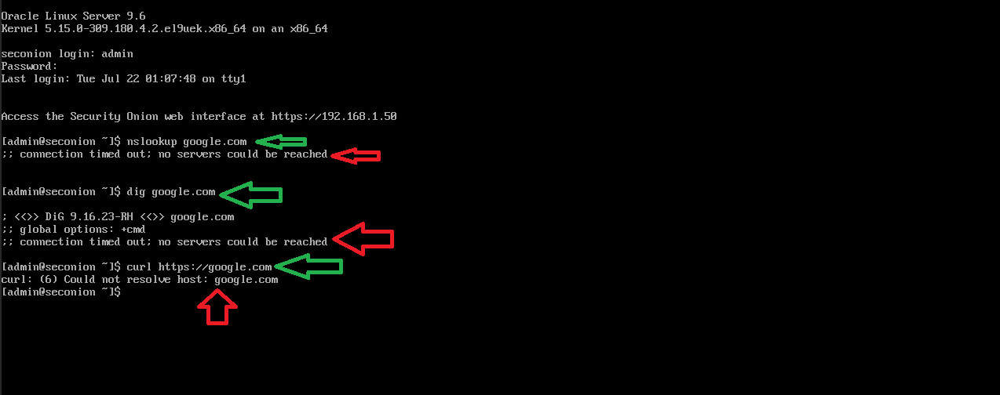

---

### 🟢 After Fix (Invert Match applied):

- DNS resolution restored on all VLAN clients

- Pi-hole successfully reached upstream servers 

---

- Windows 10 Client (Fixed)
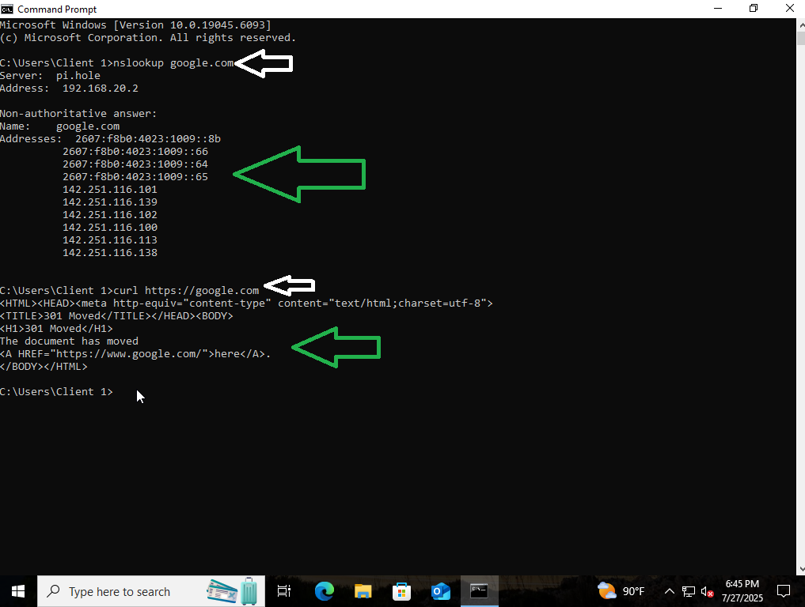

- Debian Admin Workstation (Fixed)


- Windows Server 2019 (Fixed)


---

### curl https://google.com – Output 

- Metasploitable 2 (Fixed)
- `curl` resolves the domain successfully, confirming DNS and outbound HTTPS connectivity.
- Error `(77)` is due to missing CA certificates on the VM, not a network issue.
- Therefore, network fix is confirmed to be working.

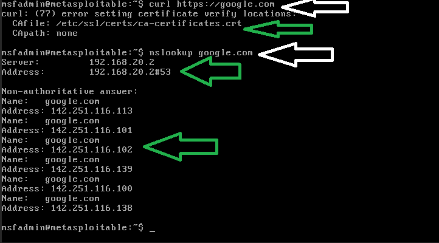
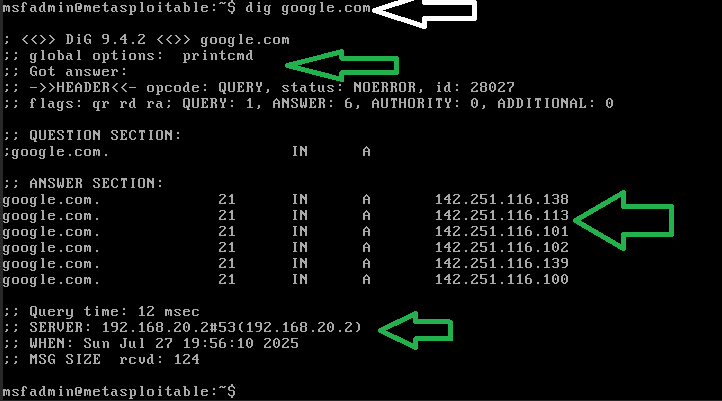

- Pihole (Fixed)


- Kali Linux (Fixed)
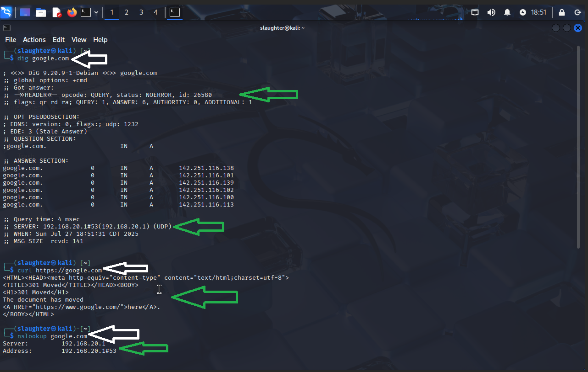

- Security Onion (Fixed)

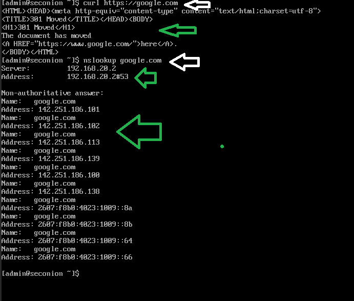
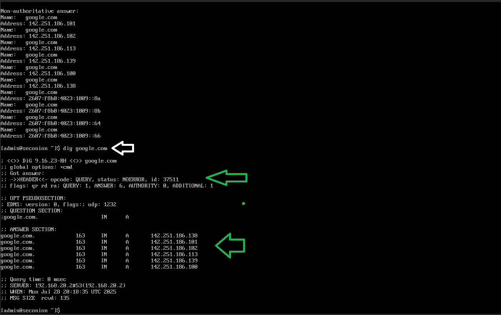


## 📌 Notes

- This issue highlights the importance of properly scoping NAT rules when using local DNS services

- Invert Match ensures the DNS server itself is not affected by the redirect loop
