# 🛠️ Troubleshooting DNS and Pi-hole Issues

## ❌ Problem: Client devices and Pi-hole itself were unable to resolve domain names.

### Symptoms:
- `nslookup` and `dig` commands failed with timeouts
- `curl` returned “Could not resolve host”
- Pi-hole showed upstream DNS and NTP errors
- DHCP was functional, but no name resolution

- Pi-hole dashboard shows errors about NTP and upstream DNS
- Clients appear to get IP via DHCP, but no hostname resolution

## 🧠 Root Cause:

The **pfSense NAT Port Forward rule** redirected all DNS traffic (port 53) to Pi-hole — including traffic **originating from Pi-hole itself**.

Since the rule did **not exclude Pi-hole's own IP (`192.168.20.2`)**, the DNS resolver looped back and failed to reach any upstream servers (e.g., `8.8.8.8`).

Additionally:
- `/etc/resolv.conf` on Pi-hole pointed to `127.0.0.1`
- DNSSEC caused further resolution failures


## ✅ Resolution Steps
1. **Edit NAT Port Forward Rule in pfSense:**
   - Add `Invert Match` to source IP field for each VLAN (10,20,30)
   - This prevents Pi-hole’s own DNS queries from being redirected back to itself
---

- VLAN10
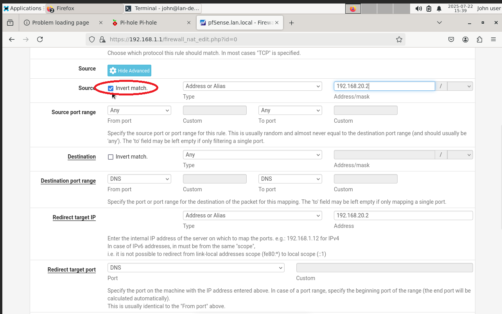
- VLAN20
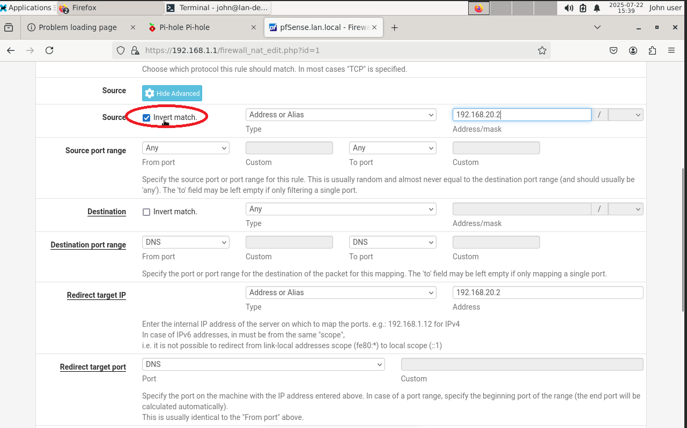
- VLAN30


2. **Update Pi-hole Settings:**
   - Enter Pihole's DNS setting and Set upstream DNS (e.g., Google `8.8.8.8`, Cloudflare `1.1.1.1`)

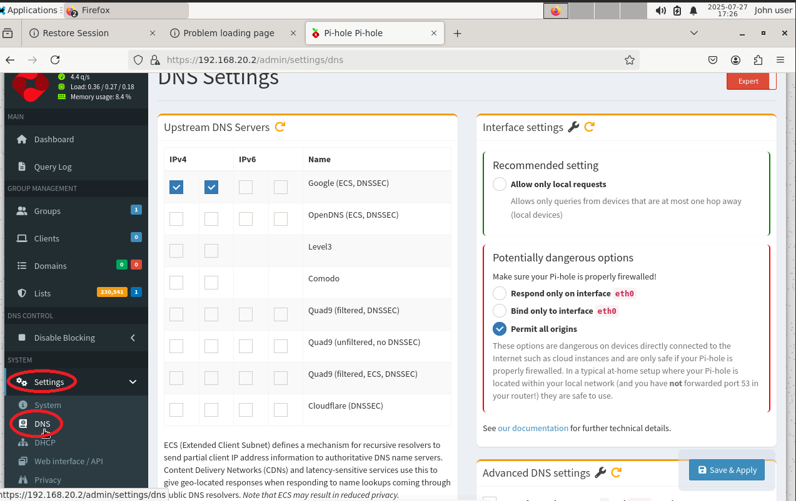
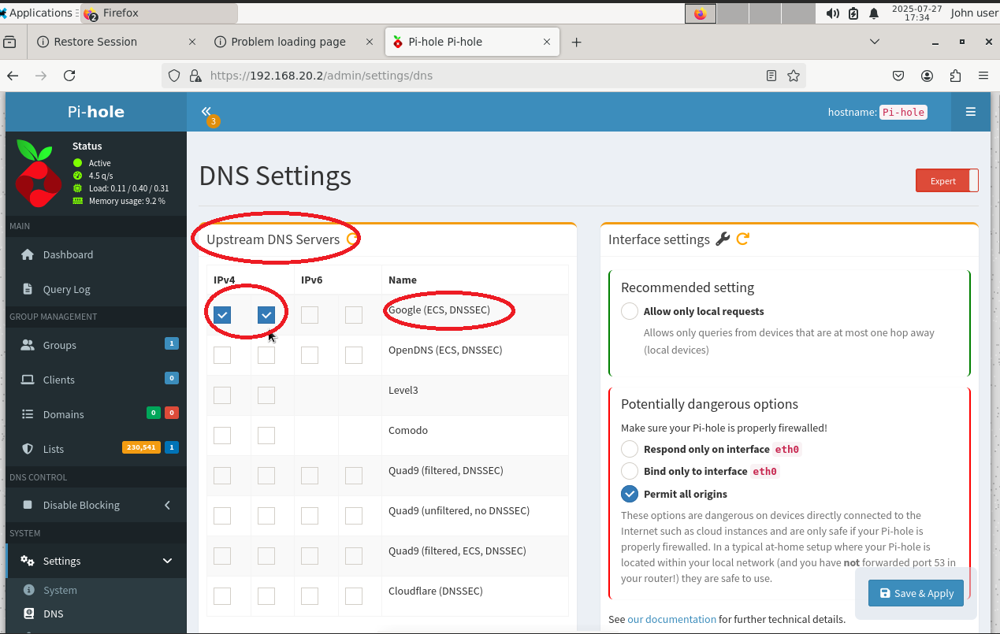

   - 'Uncheck Use DNSSEC' to Disable DNSSEC

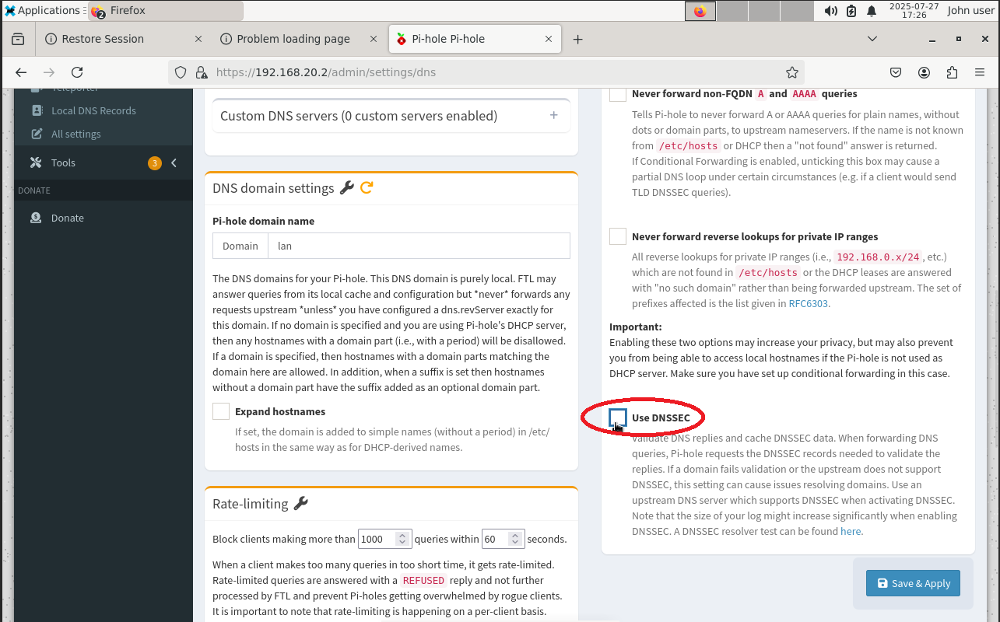

3. **Update `/etc/resolv.conf`**
   ```bash
   sudo nano /etc/resolv.conf
   # Change to:
   nameserver 1.1.1.1
   nameserver 8.8.8.8
   Press CTRL + O to save the file ("Write Out")
   Press Enter to confirm the filename
   Press CTRL + X to exit nano

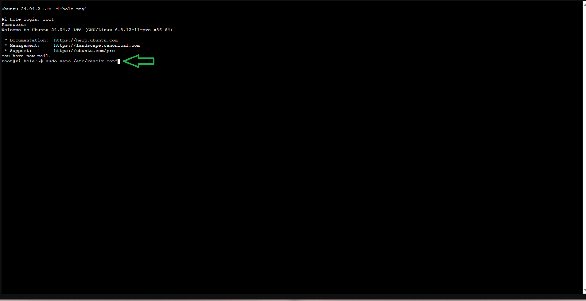


---

# DNS Resolution Test (Before and After NAT Invert Match Fix)

This folder documents how DNS resolution was affected when the NAT redirect rules for DNS traffic were **not** excluding the Pi-hole (`192.168.20.2`) via "Invert Match."

---

## 🔧 Problem Summary

When **"Invert match"** was **unchecked** in the NAT Port Forward rule:

- All DNS traffic, including Pi-hole’s own queries, was redirected back to itself.
- This caused Pi-hole to fail DNS resolution because it could not reach upstream DNS (like 8.8.8.8).
- As a result, **clients in all VLANs could not resolve domain names**.

---

## 🧪 DNS Testing Tools (Before vs After Fix)

The following commands were used in each VMs console to confirm DNS status from clients:

```bash
nslookup google.com
dig google.com
curl https://www.google.com
```

### 🔴 Before Fix:

- All tools failed across all client VMs
- Pi-hole unable to reach upstream DNS

---

- Windows 10 Client
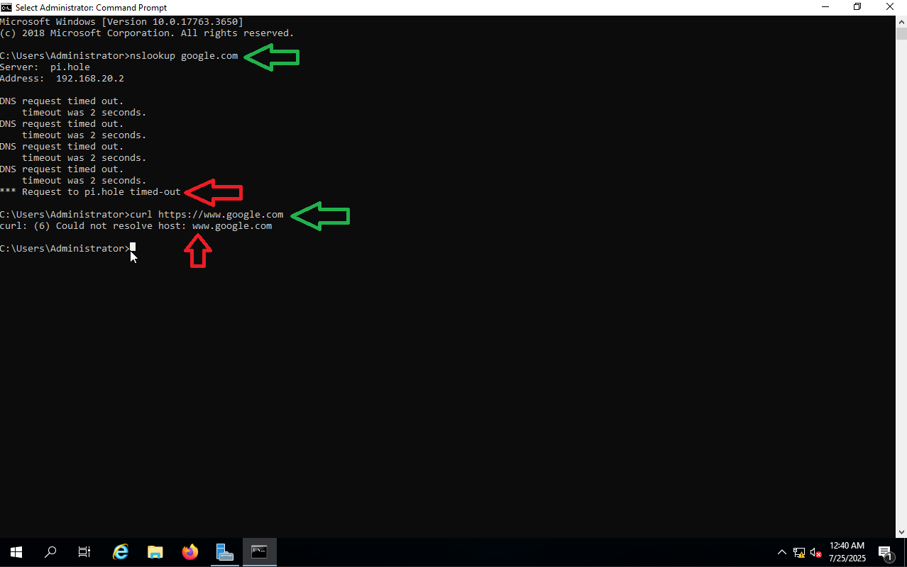

- Debian Admin Workstation


- Windows Server 2019
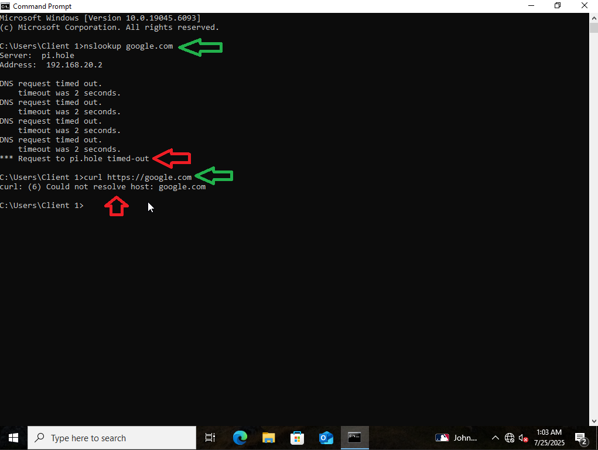


- Metasploitable 2
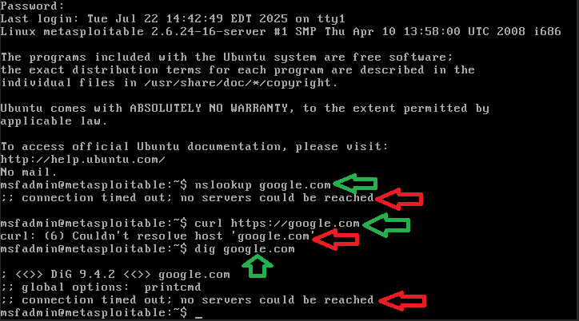


- Pihole

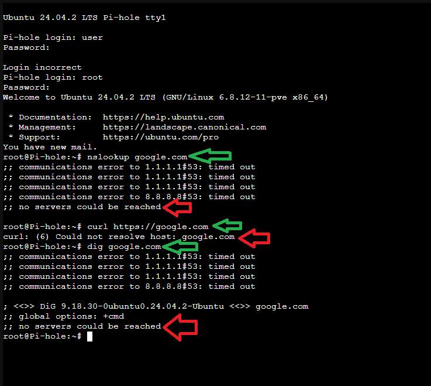


- Kali Linux
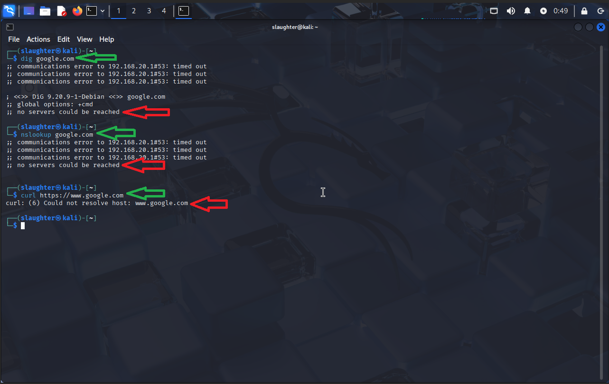


- Security Onion


### 🟢 After Fix (Invert Match applied):

- DNS resolution restored on all VLAN clients

- Pi-hole successfully reached upstream servers 

---
- Windows 10 Client (Fixed)


- Debian Admin Workstation (Fixed)
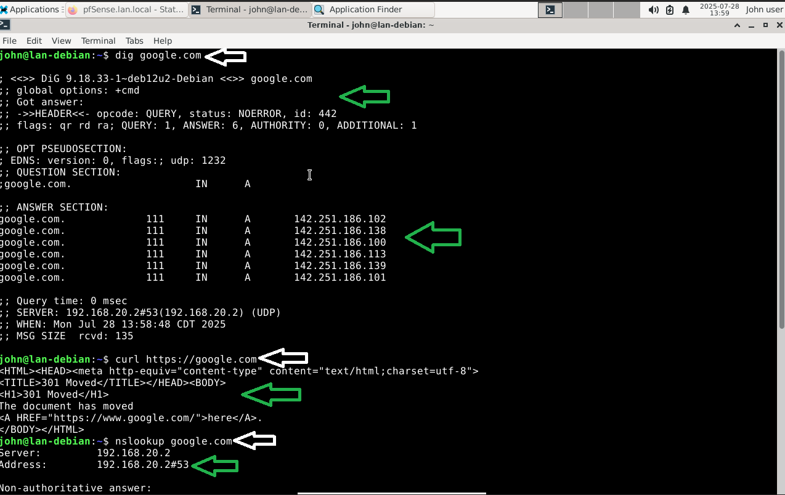

- Windows Server 2019 (Fixed)
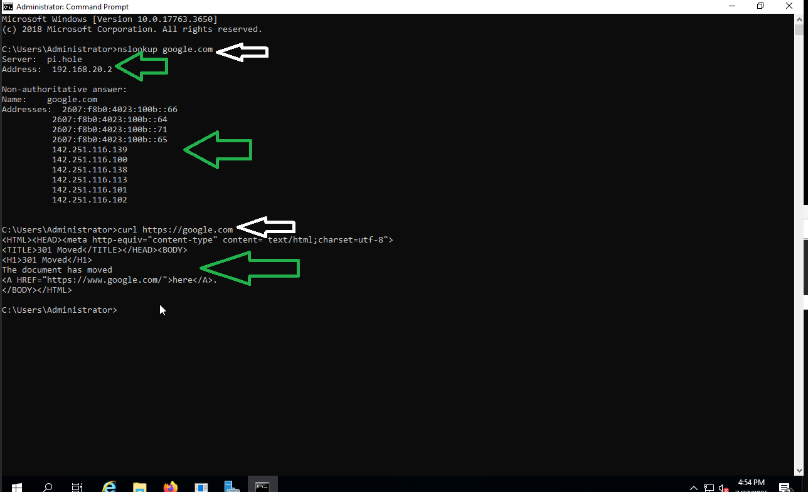

### curl https://google.com – Output 

- Metasploitable 2 (Fixed)
- `curl` resolves the domain successfully, confirming DNS and outbound HTTPS connectivity.
- Error `(77)` is due to missing CA certificates on the VM, not a network issue.
- Therefore, network fix is confirmed to be working.

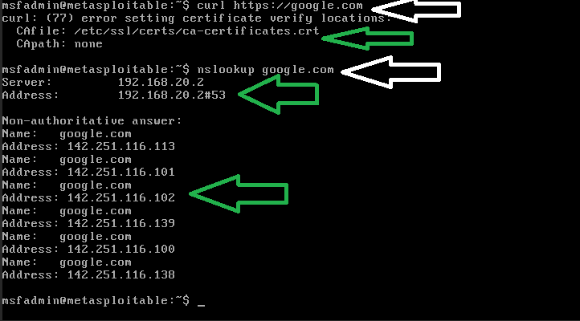


- Pihole (Fixed)
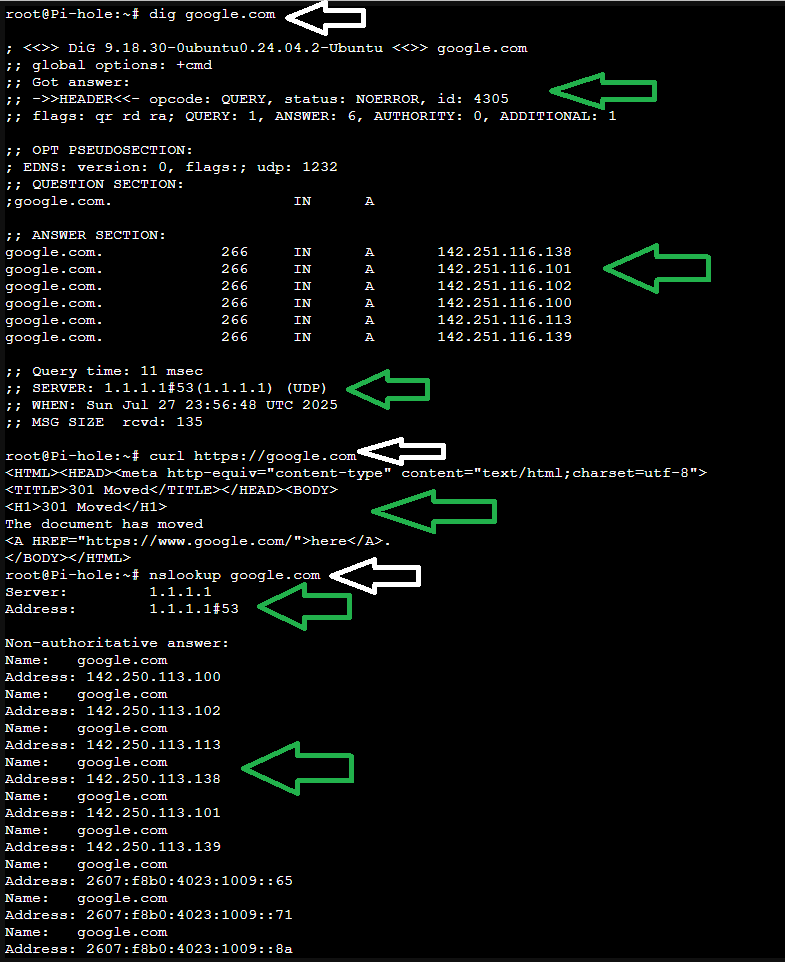

- Kali Linux (Fixed)
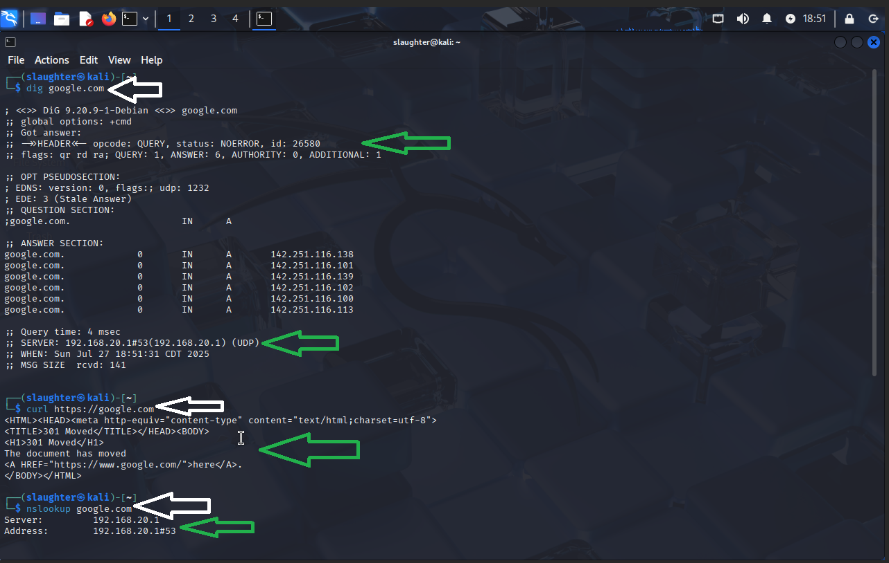

- Security Onion (Fixed)

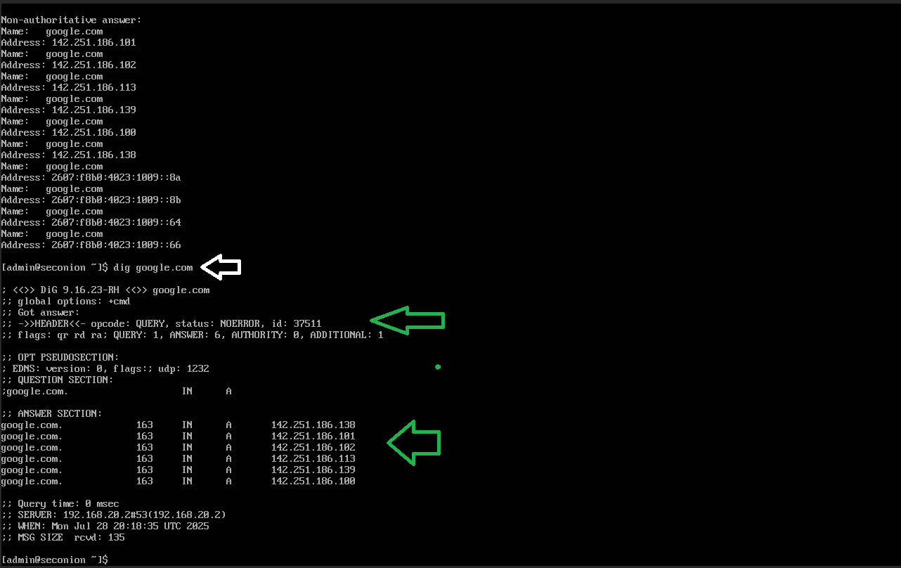


## 📌 Notes

- This issue highlights the importance of properly scoping NAT rules when using local DNS services

- Invert Match ensures the DNS server itself is not affected by the redirect loop
