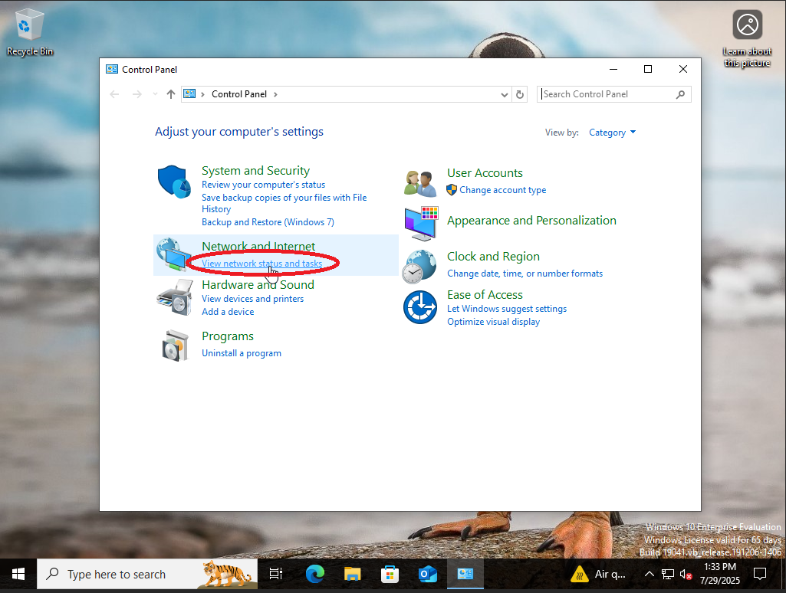
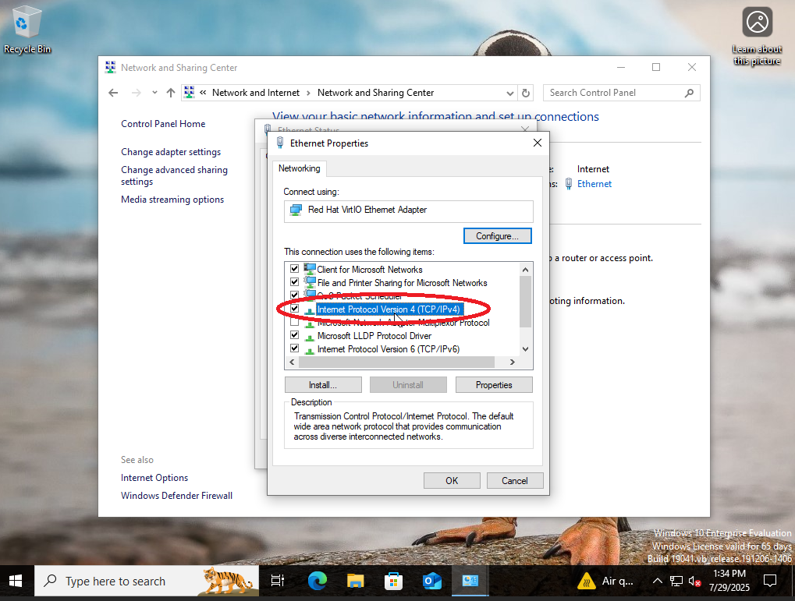
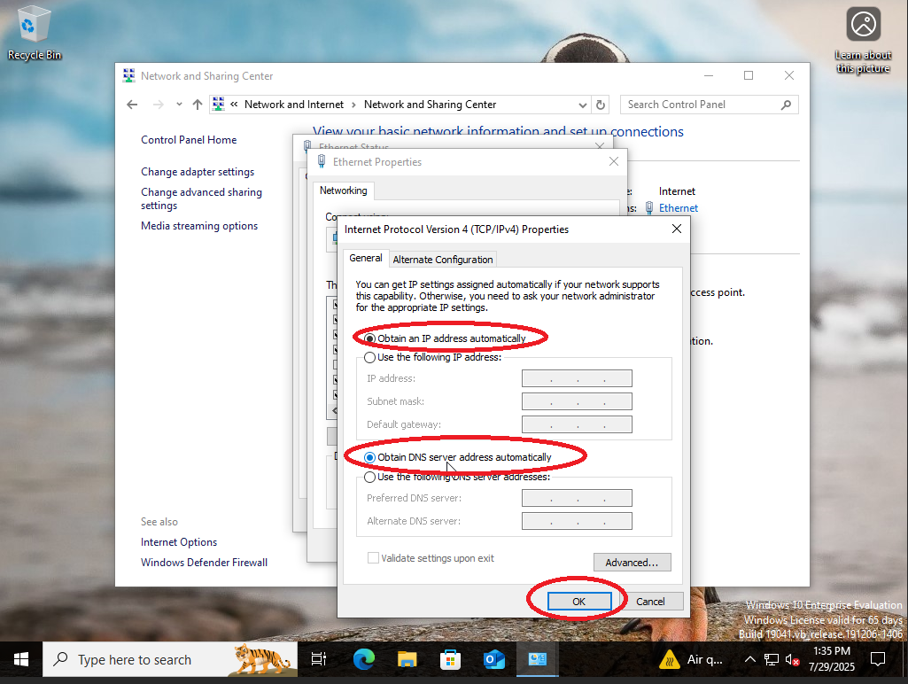
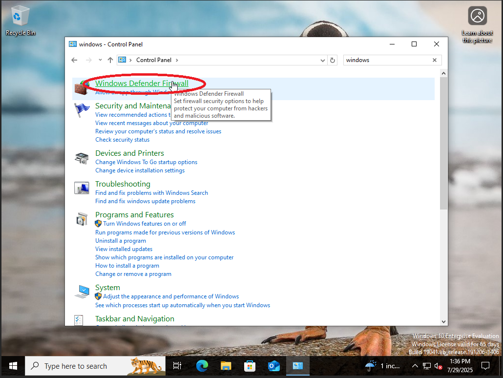
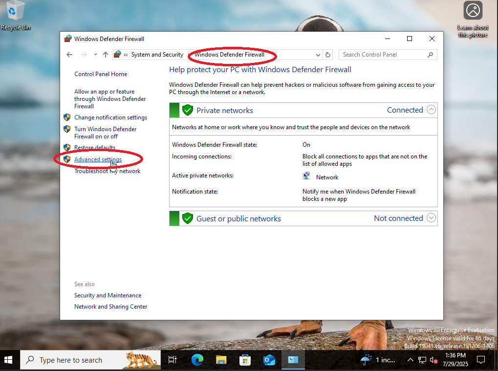
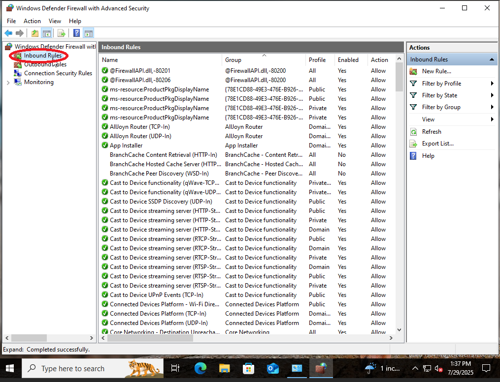
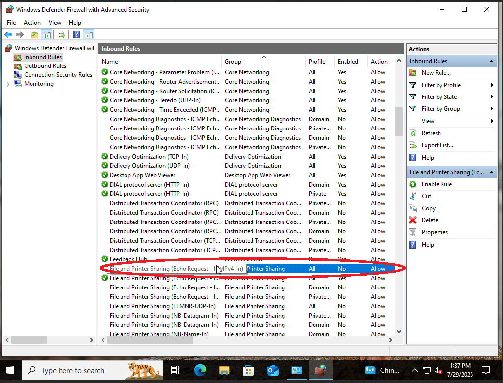
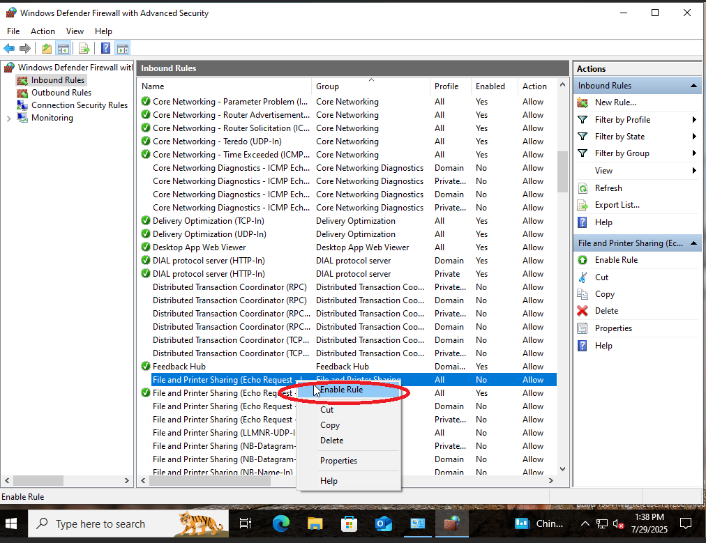
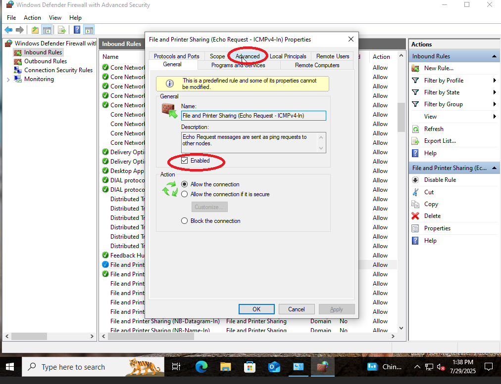

# 💻 Windows 10 Client (VLAN 30)

## 🔧 Network Configuration

- **VLAN**: 30  
- **IP Address**: 192.168.30.100 (via DHCP)  
- **DHCP Enabled**: Yes  
- **Default Gateway**: 192.168.30.1  
- **DNS Server**: 192.168.20.2 (Pi-hole)

---

## ✅ Steps to Enable DHCP

1. Open **Control Panel**

2. Navigate to **Network and Internet** → **Network Status and Tasks**

3. Click on **Change adapter settings**

4. Right-click the **Ethernet adapter** and select **Properties**

5. Select **Internet Protocol Version 4 (TCP/IPv4)** → Click **Properties**

   
6. Choose:
   - `Obtain an IP address automatically`
   - `Obtain DNS server address automatically`
   - Click **OK** and close all dialog boxes.

---

## 🔓 Enable ICMP Echo Requests (For Pinging)

To allow this client to **be pinged by others**:

1. Open **Windows Defender Firewall with Advanced Security**

3. Go to **Inbound Rules**

5. Enable the following rule:
   - `File and Printer Sharing (Echo Request - ICMPv4-In)`

6. Apply the rule to:
   - `Domain`, `Private`, and `Public` profiles  
   - Under the **Advanced** tab

---

## 🔍 Network Verification

| Test                        | Command                          | Expected Output                        |
|-----------------------------|----------------------------------|----------------------------------------|
| IP Configuration            | `ipconfig`                       | Shows IP: `192.168.30.100`             |
| Ping Gateway                | `ping 192.168.30.1`              | Successful replies                     |
| Ping DNS (Pi-hole)         | `ping 192.168.20.2`              | Successful replies                     |
| Ping Windows Server         | `ping 192.168.20.102`            | Successful replies if firewall allows  |
| DNS Resolution Test        | `nslookup google.com`            | Should resolve via Pi-hole             |
| Routing Table              | `route print`                    | Shows routes for VLAN 30 subnet        |

---

## 📸 Suggested Screenshot Checklist

- `ipconfig` output  
- Ping tests to gateway and DNS  
- Ping test to Windows Server (`192.168.20.102`)  
- Successful `nslookup`  
- Firewall rule enabled in "Inbound Rules"  
- Adapter settings showing DHCP enabled  

### `ipconfig`
