# 🖥️ Windows Server (VLAN 20)

## 🔧 Network Configuration

- **VLAN**: 20  
- **IP Address**: 192.168.20.102 (via DHCP)  
- **DHCP Enabled**: Yes  
- **Default Gateway**: 192.168.20.1  
- **DNS Server**: 192.168.20.2 (Pi-hole)  

---

## ✅ Steps to Enable DHCP

1. Open **Control Panel**

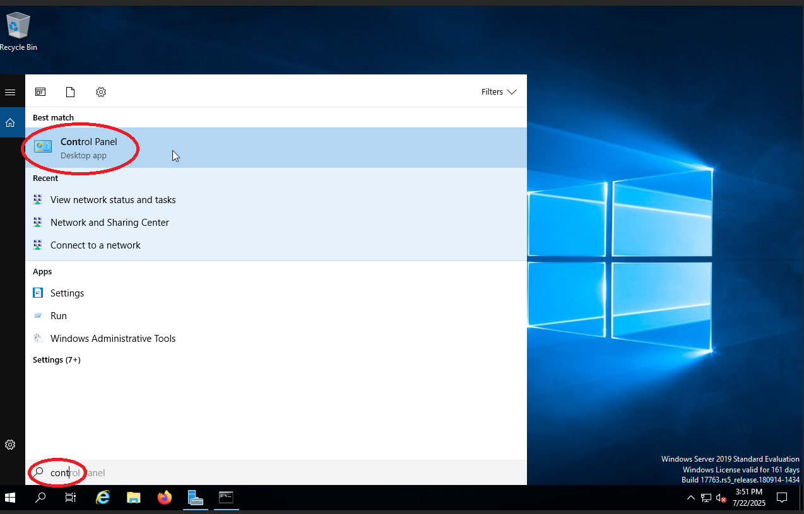

2. Navigate to **Network and Internet** → **Network Status and Tasks**

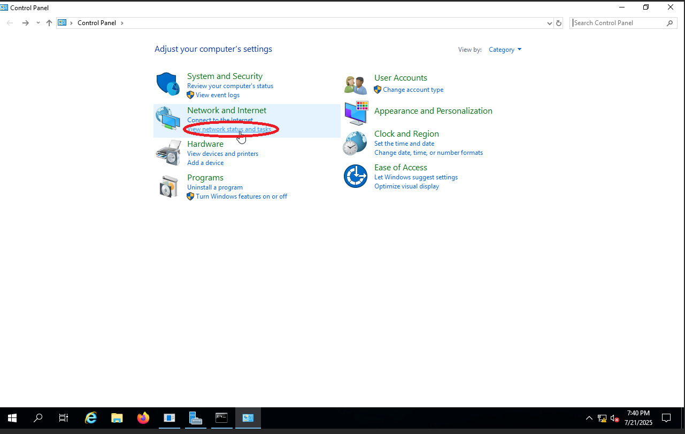

3. Click on **Change adapter settings**

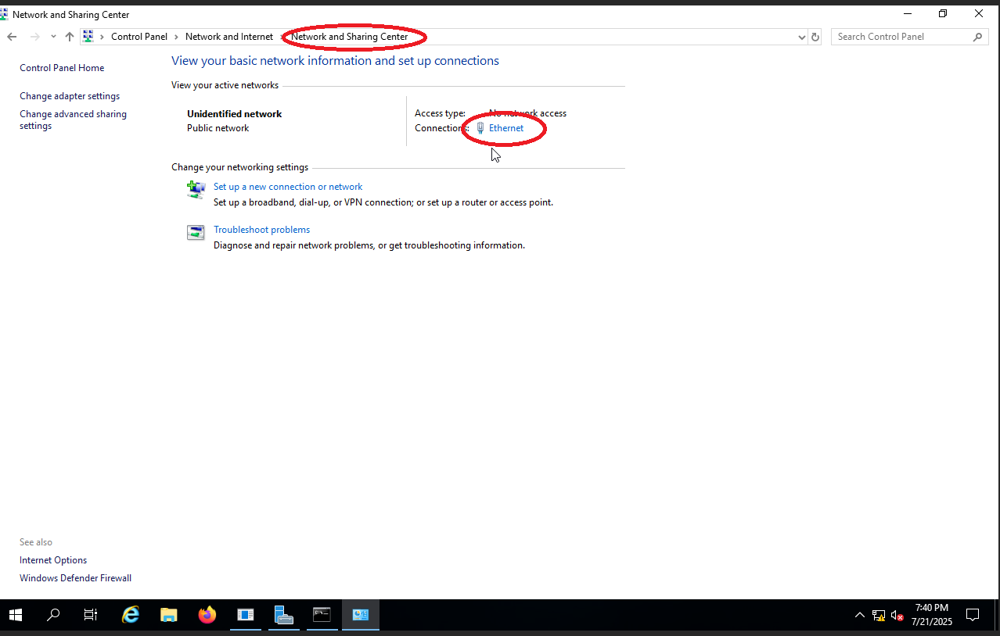

4. Right-click the **Ethernet adapter** and select **Properties**

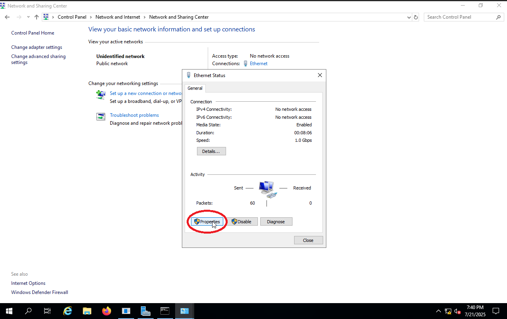

5. Select **Internet Protocol Version 4 (TCP/IPv4)** → Click **Properties**

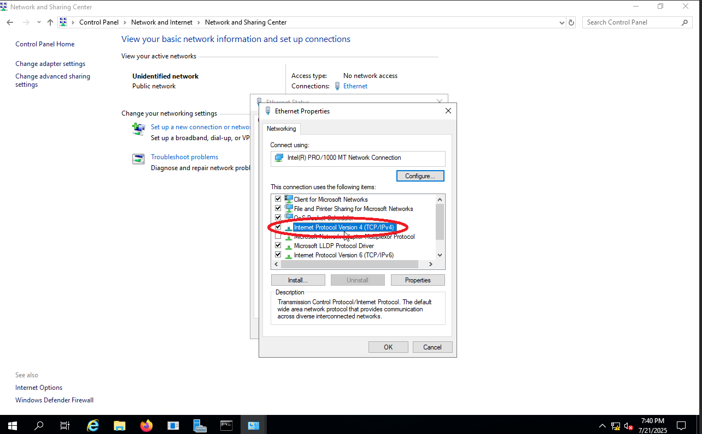
6. Choose:
   - `Obtain an IP address automatically`
   - `Obtain DNS server address automatically`
   - Click **OK** and close all dialog boxes.

---

## 🔓 Enable ICMP Echo Requests (For Pinging)

To ensure the server can be pinged by other machines:

1. Open **Windows Defender Firewall then into Advanced Settings**

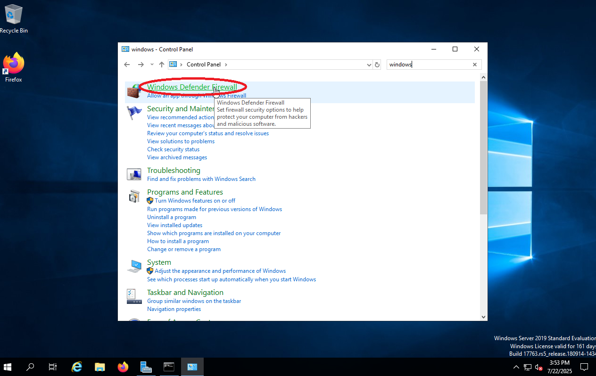
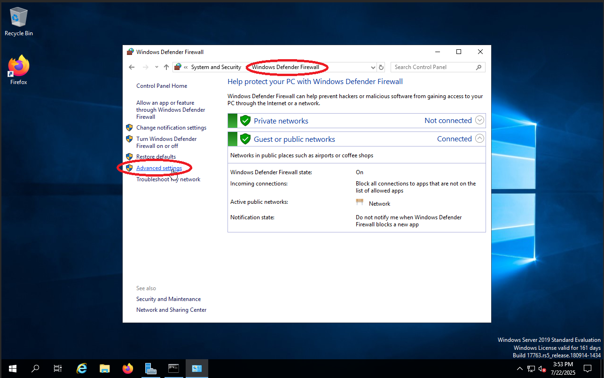

2. Go to **Inbound Rules**  
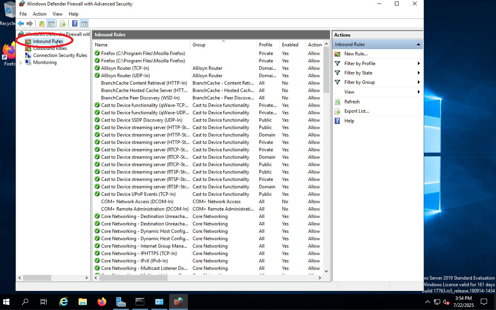

3. Enable the following rule:
   - `File and Printer Sharing (Echo Request - ICMPv4-In)`
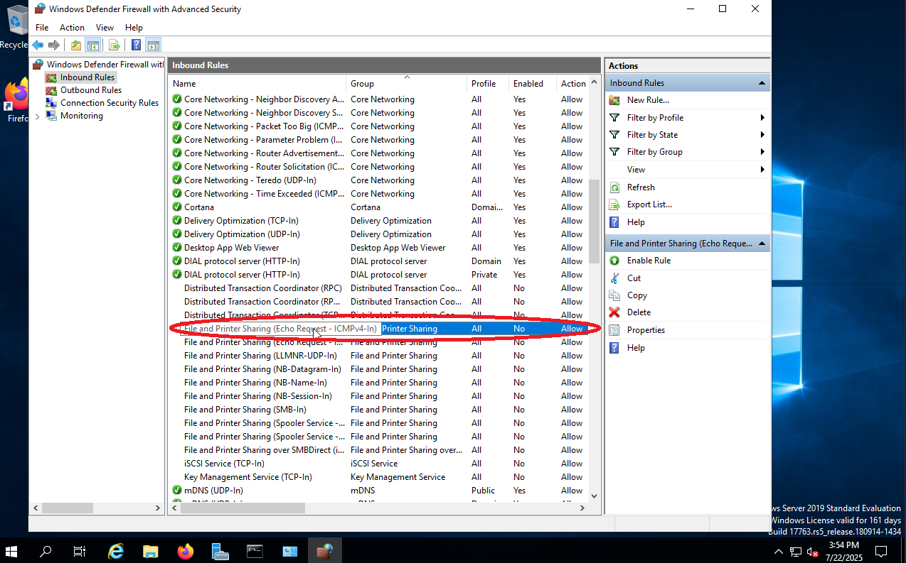
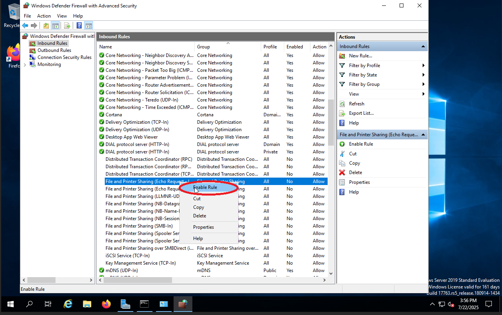

4. Under the **Advanced** tab, apply the rule to:  
   - `Domain`, `Private`, and `Public` profiles

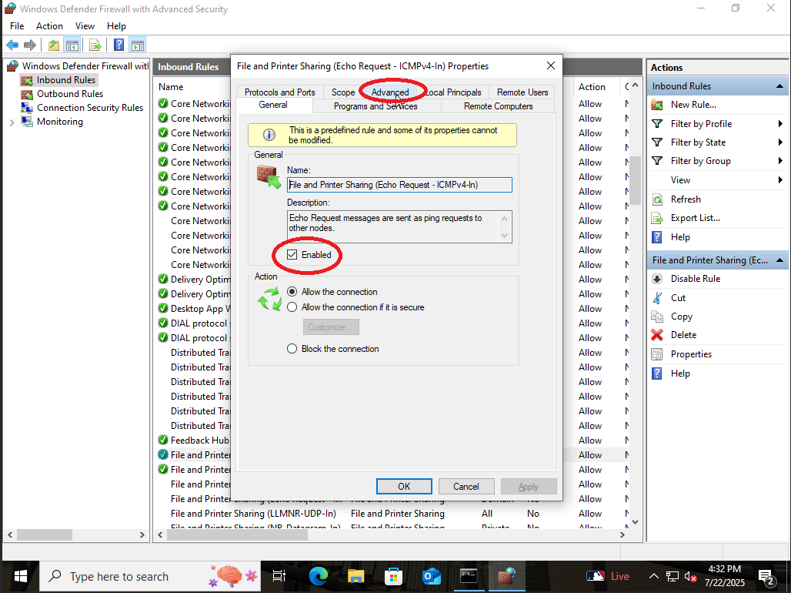
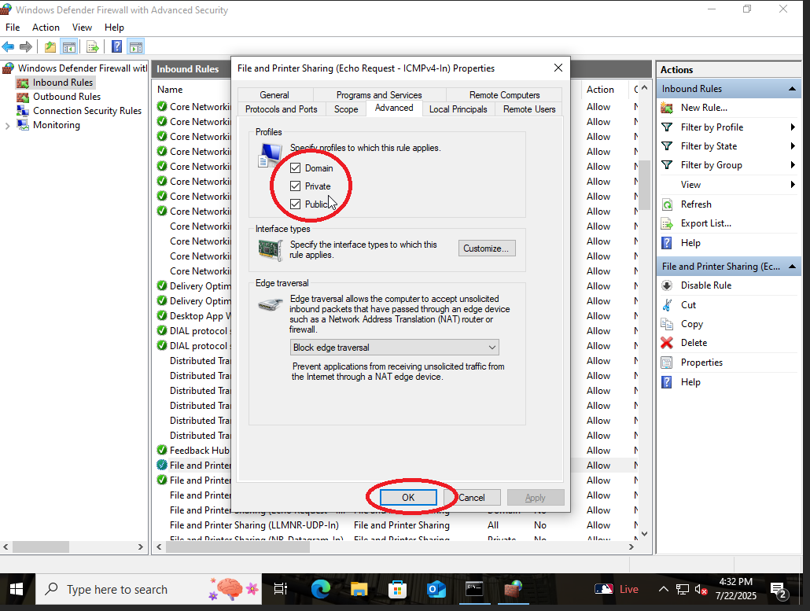

---

## 🔍 Network Verification Tests

| Test                      | Command                       | Expected Result                          |
|---------------------------|-------------------------------|-------------------------------------------|
| IP Configuration          | `ipconfig`                    | Shows: `192.168.20.102`                   |
| Ping Gateway              | `ping 192.168.20.1`           | Successful replies                        |
| Ping DNS (Pi-hole)        | `ping 192.168.20.2`           | Successful replies                        |
| Ping Another VM (Kali)    | `ping 192.168.30.100`         | Replies if firewall allows                |
| DNS Resolution            | `nslookup google.com`         | Resolves via Pi-hole                      |
| View Routing Table        | `route print`                 | Displays route to VLAN 20 and 0.0.0.0     |

---

## 📸 Suggested Screenshot Checklist

- `ipconfig /all , ping tests to gateway (192.168.20.1) , ping to DNS (192.168.20.2)' output

- 'Ping to DNS (192.168.20.2) , ping to another VM (Kali: 192.168.30.100) and Successful `nslookup`'   
 

- 'route print' output verify sends traffic to other networks 0.0.0.0 (eg: Internet) and specific router for local VLAN 192.168.20.0 On-link: means it knows to use ARP on that subnet.
 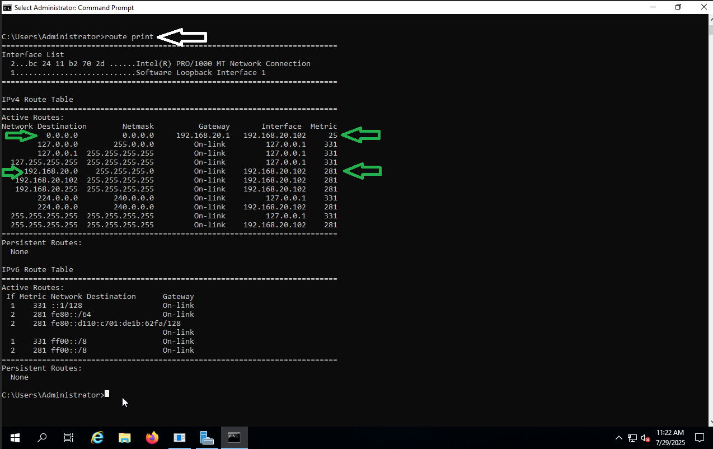

---

