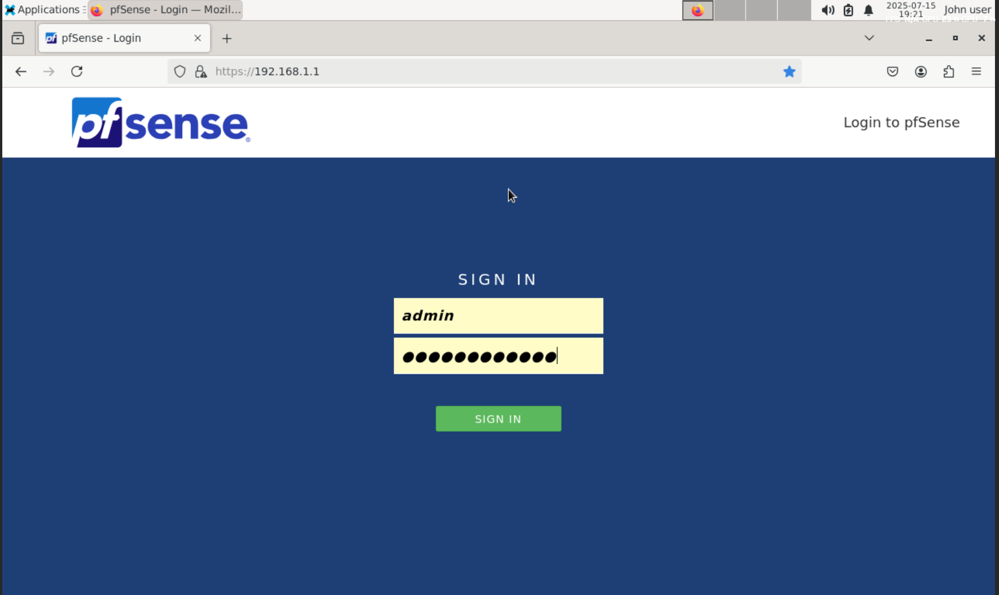
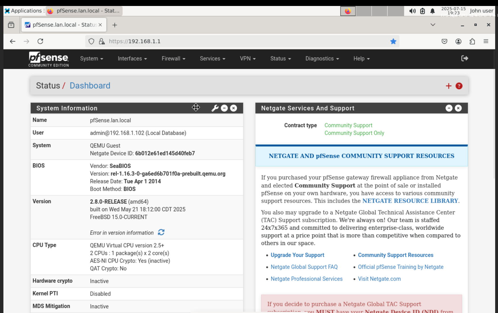
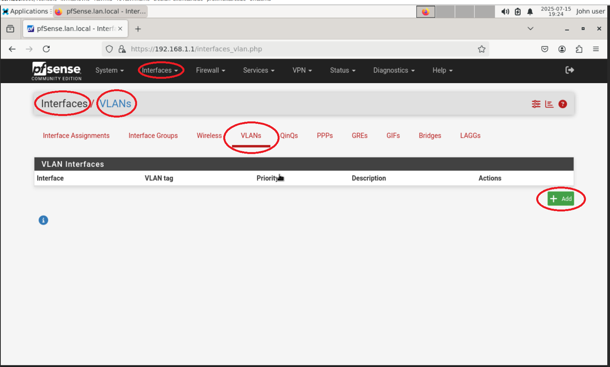
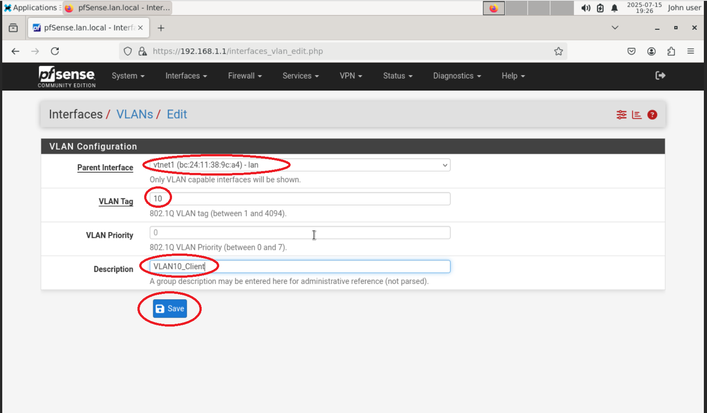
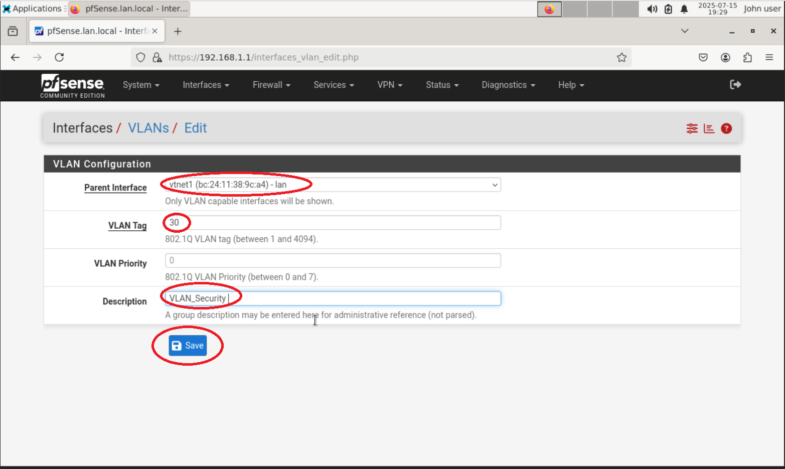
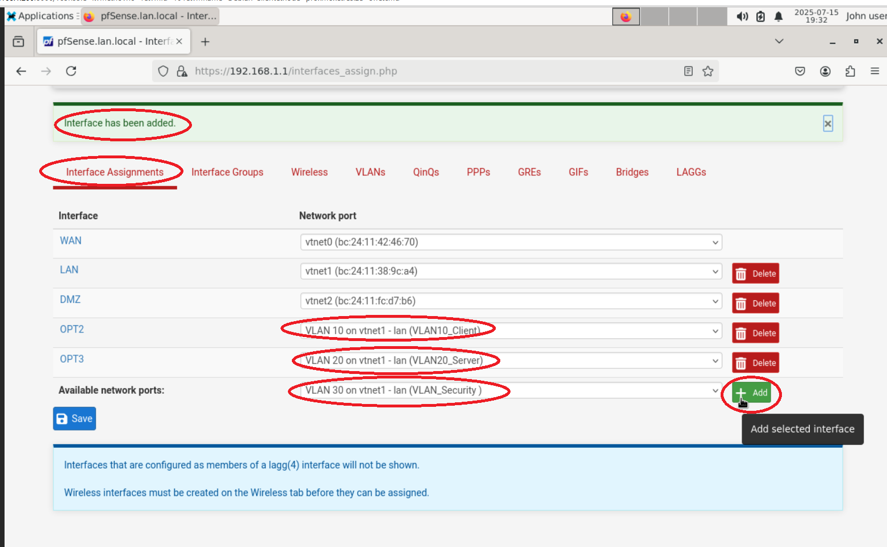
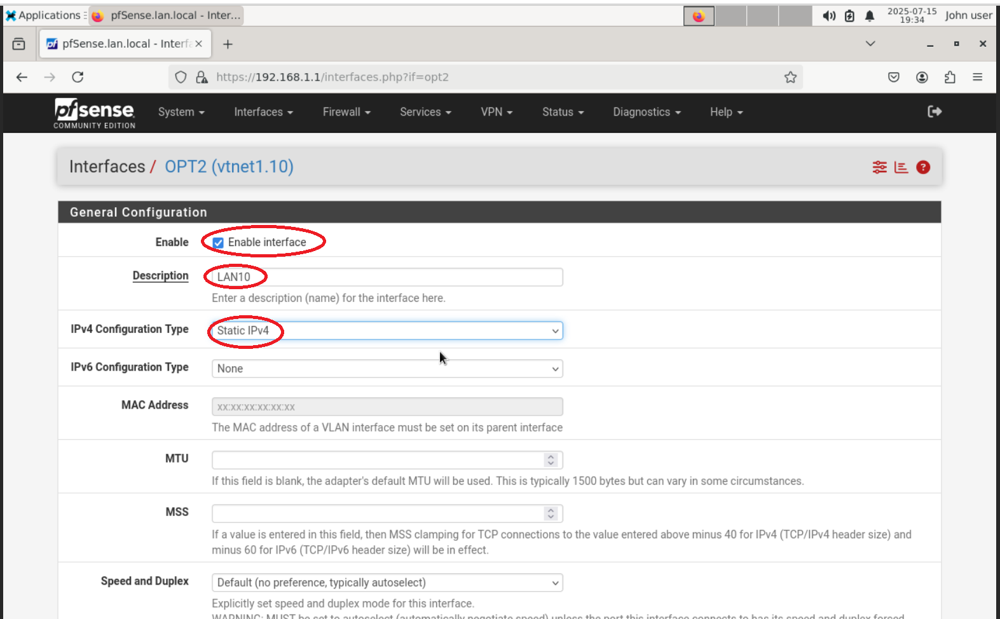

# 🧩 Step 3: Configure VLANs in pfSense

This document outlines how to configure VLANs in pfSense to segment your Proxmox virtual lab network into isolated zones.

## 🎯 Objective
Segment the virtual lab network into three VLANs and route traffic securely using pfSense.

### VLAN Structure:
| VLAN ID | Name     | Subnet             |
|---------|----------|--------------------|
| 10      | Clients  | 192.168.10.0/24    |
| 20      | Servers  | 192.168.20.0/24    |
| 30      | Security | 192.168.30.0/24    |

## 🔐 Log into pfSense
Access the pfSense web interface from your **Debian Admin VM** (tagged to VLAN 10):

- **URL:** `https://[pfSense LAN IP]`
- **Default Credentials:**
  - **Username:** `admin`
  - **Password:** `pfsense`
  -(As you can see there are more characters in the password box as i made up my own)

## pfSense Dashboard

Once logged in, you will see the dashboard.

---

## 🔧 Create VLAN Interfaces

1. Navigate to: `Interfaces > Assignments > VLANs`
2. Click **➕ Add** for each VLAN.

---

### ➕ VLAN 10 – Clients

- **Parent Interface:** vmbr1 NIC (e.g., `vtnet1`)
- **VLAN Tag:** `10`
- **Description:** `VLAN10_Client`
  
✅ Click **Save**, then **Apply Changes**.

---

### ➕ VLAN 20 – Servers- 

- **VLAN Tag:** `20`
- **Description:** `VLAN20_Servers`

---

### ➕ VLAN 30 – Security
- **VLAN Tag:** `30`
- **Description:** `VLAN30_Security`

---

## 📋 Review All VLANs

After all are added, the VLAN list should appear like this:

---

## 🧬 Assign VLAN Interfaces

1. Go to `Interfaces > Assignments`
2. Click **+ Add** to assign each new VLAN interface.
   

Click **+ Add** to assign each new VLAN interface (Do this for each interface: VLAN10, VLAN20, VLAN30)

Then we go into VLAN10 and name the interface LAN10, select "Static IPv4" for IPv4 configuration type, then put in the IPv4 static default gateway address for that vlan (VLAN10 = 192.168.10.1/24), and click Save

