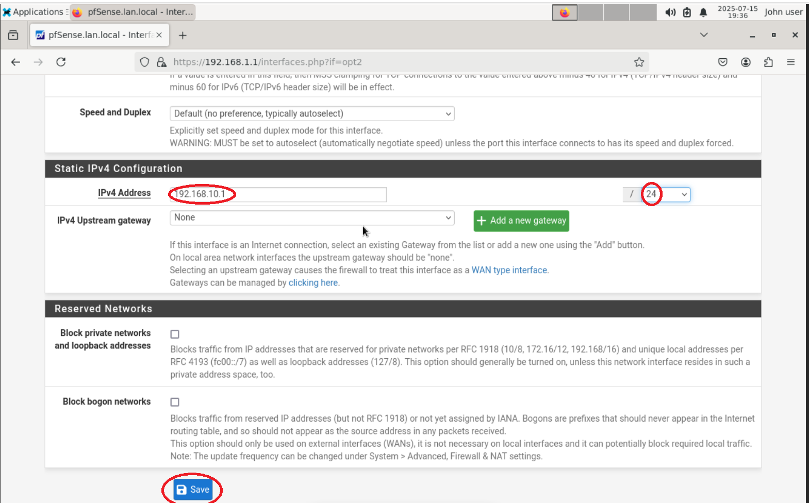
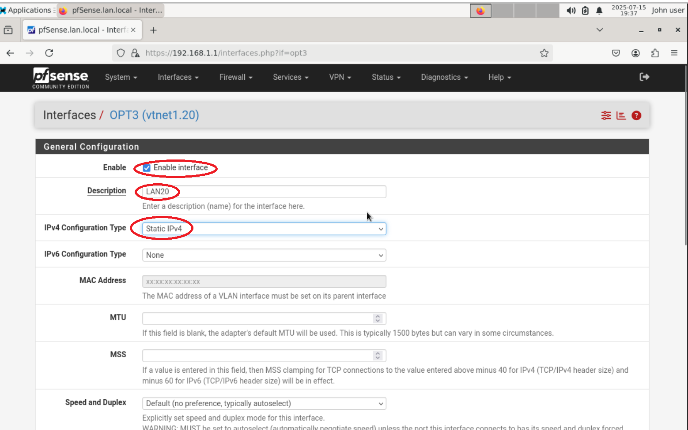
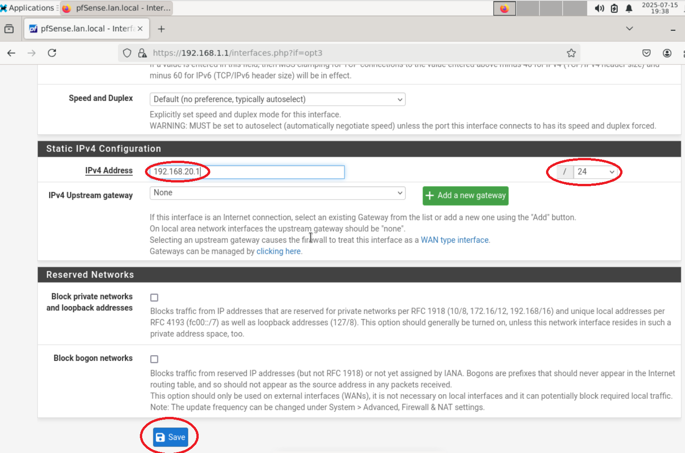
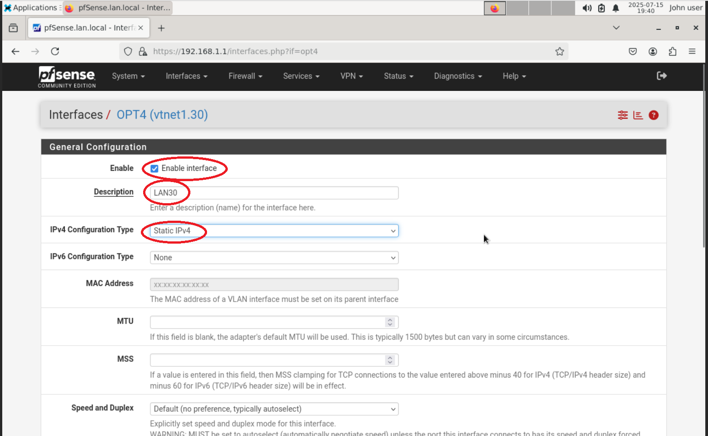
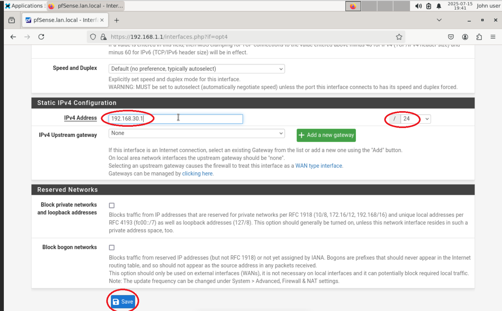
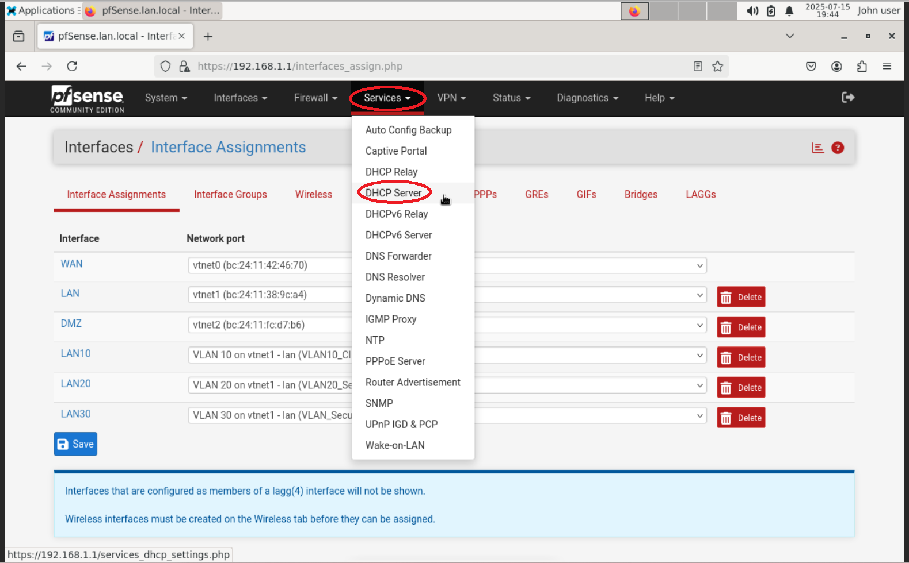
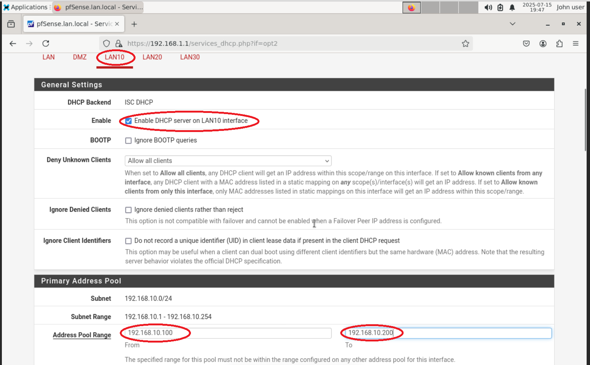
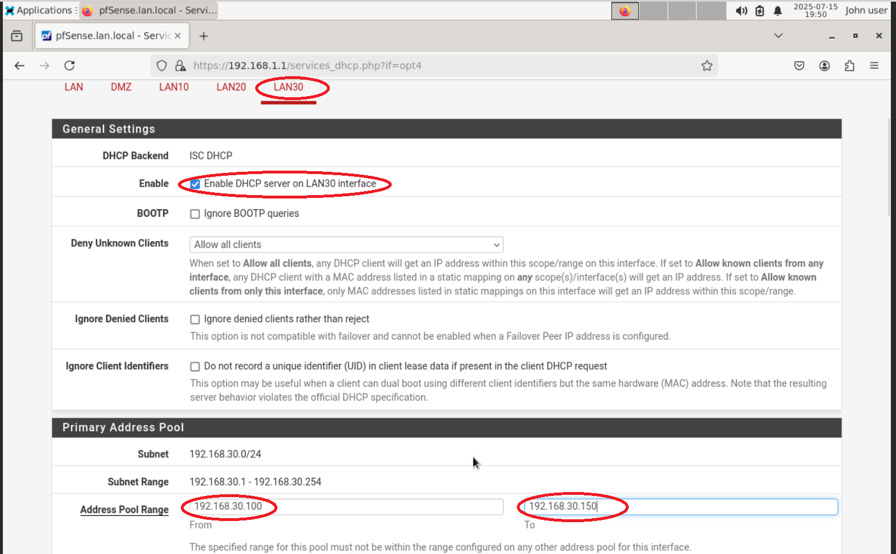

# 🧩 Step 3: Configure VLANs in pfSense

This document outlines how to configure VLANs in pfSense to segment your Proxmox virtual lab network into isolated zones.

## 🎯 Objective
Segment the virtual lab network into three VLANs and route traffic securely using pfSense.

### VLAN Structure:
| VLAN ID | Name     | Subnet             |
|---------|----------|--------------------|
| 10      | Clients  | 192.168.10.0/24    |
| 20      | Servers  | 192.168.20.0/24    |
| 30      | Security | 192.168.30.0/24    |

## 🔐 Log into pfSense
Access the pfSense web interface from your **Debian Admin VM** (tagged to VLAN 10):

- **URL:** `https://[pfSense LAN IP]`
- **Default Credentials:**
  - **Username:** `admin`
  - **Password:** `pfsense`
  -(As you can see there are more characters in the password box as i made up my own)

## pfSense Dashboard

Once logged in, you will see the dashboard.

---

## 🔧 Create VLAN Interfaces

1. Navigate to: `Interfaces > Assignments > VLANs`
2. Click **➕ Add** for each VLAN.

---

### ➕ VLAN 10 – Clients

- **Parent Interface:** vmbr1 NIC (e.g., `vtnet1`)
- **VLAN Tag:** `10`
- **Description:** `VLAN10_Client`
  
✅ Click **Save**, then **Apply Changes**.

---

### ➕ VLAN 20 – Servers- 

- **VLAN Tag:** `20`
- **Description:** `VLAN20_Servers`

---

### ➕ VLAN 30 – Security
- **VLAN Tag:** `30`
- **Description:** `VLAN30_Security`

---

## 📋 Review All VLANs

After all are added, the VLAN list should appear like this:

---

## 🧬 Assign VLAN Interfaces

1. Go to `Interfaces > Assignments`
2. Click **+ Add** to assign each new VLAN interface.
   

---

### ⚙️ Configure LAN10 Interface (VLAN 10)
1. Click the new interface name (e.g., OPT1 → rename to **LAN10**).
2. Enable the interface.
3. Set **IPv4 Configuration Type** to `Static IPv4`.
4. Enter:
   - **IP Address:** `192.168.10.1`
   - **Subnet Mask:** `/24`

💾 Save and **Apply Changes**.

---

## 🔁 Repeat for VLAN20 and VLAN30

Follow the same steps above for:

- **LAN20 (VLAN 20)**
  - IP: `192.168.20.1/24`
    

- **LAN30 (VLAN 30)**
  - IP: `192.168.30.1/24`

---

# 🛠️ Step 4: Enable DHCP on Each VLAN

## 🔹 Navigate to `Services > DHCP Server`

---

### 📦 Enable DHCP for LAN10

- Select `LAN10` tab
- Check **Enable DHCP server on LAN10 interface**
- Set Range:  
  - **From:** `192.168.10.100`  
  - **To:** `192.168.10.200`
- Click **Save**

---

### 📦 Enable DHCP for LAN20

- Select `LAN20` tab
- Check **Enable DHCP server on LAN20 interface**
- Set Range:  
  - **From:** `192.168.20.100`  
  - **To:** `192.168.20.200`
- Click **Save**

---

### 📦 Enable DHCP for LAN30

- Select `LAN30` tab
- Check **Enable DHCP server on LAN30 interface**
- Set Range:  
  - **From:** `192.168.30.100`  
  - **To:** `192.168.30.150`
- Click **Save**

---

#🔒 Step 5: Add Allow-All Firewall Rules (Testing Phase)
During the initial setup, we will allow all traffic between VLANs by adding permissive rules to each VLAN interface. This is just for testing. Later, we’ll apply segmentation rules to restrict access.

# 🔧 Navigate to Firewall Rules
- Go to **Firewall > Rules** from the pfSense menu bar.

